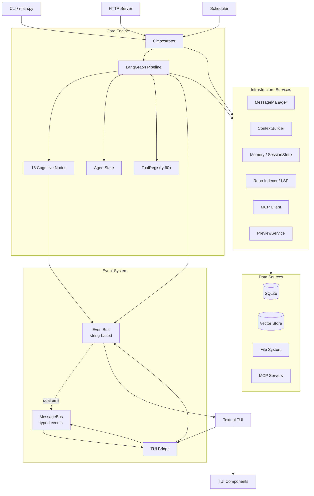
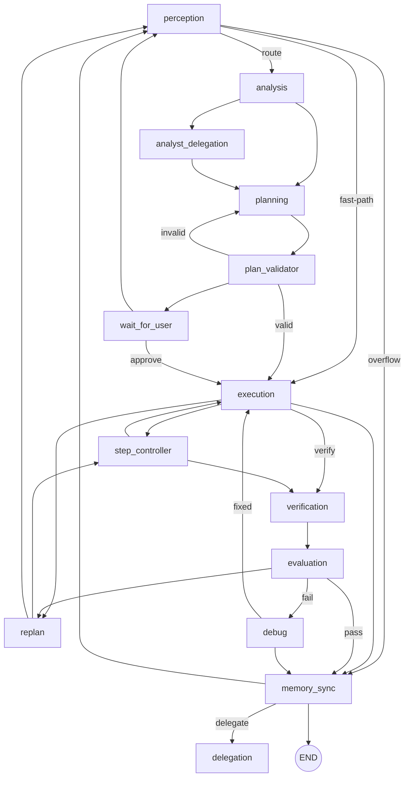

# CodingAgent Architecture

Single source of truth for the system architecture. Supersedes `docs/ARCHITECTURE_FLOWS.md`, `docs/codingagent-architecture.md`, and `docs/architecture/MESSAGE_BUS.md`.

---

## System Overview



---

## Code Layout

```
src/
├── core/
│   ├── orchestration/       # LangGraph pipeline, EventBus, services
│   │   ├── event_bus.py     # EventBus with typed dual-emission
│   │   ├── graph/           # Graph builder + 16 node files
│   │   ├── inference_loop.py
│   │   └── ...              # loop_guards, shell_hooks, permission, etc.
│   ├── messaging/           # Typed MessageBus + event types
│   │   ├── bus.py           # MessageBus (async internals, sync API)
│   │   ├── event_types.py   # 90+ typed event dataclasses
│   │   ├── events.py        # Base Event class
│   │   └── __init__.py      # Re-exports (lazy get_typed_bus/reset_typed_bus)
│   ├── inference/           # LLM adapters, provider manager
│   ├── memory/              # Session store, distiller, compaction
│   ├── context/             # ContextBuilder, prompt assembly
│   ├── indexing/            # RepoIndexer, symbol graph, LSP
│   └── mcp/                 # MCP client
├── tools/                   # 60+ @tool-decorated tools
├── config/                  # providers.json, agent-brain (SOUL/roles/skills)
├── server/                  # HTTP/SSE server
└── main.py                  # CLI entrypoint

tui/
└── src/ui/                  # Textual TUI
    ├── core_bridge.py       # Bridge (MessageBus subscriber)
    ├── _bridge_subscriptions.py  # Typed event routing table
    ├── _bridge_protocol.py  # Protocol for mixin typing
    └── app.py               # AgentApp (Textual App subclass)

docs/
└── ...
```

---

## Cognitive Pipeline

The pipeline is a LangGraph state machine with 16 nodes and conditional routing.



### Pipeline Paths

```
Fast-path: perception → execution → verification → evaluation → memory_sync
Full:     perception → analysis → planning → plan_validator → execution → verification → evaluation → memory_sync
Frontier: perception → frontier_loop → verification → evaluation → memory_sync
Overflow: perception → memory_sync → perception (context compaction)
```

---

## Event System

Two cooperating buses:

```
                           EventBus.publish("name", dict)
                                    │
                        ┌───────────┴───────────┐
                        │                       │
                   old subscribers      _build_typed_event()
                        │                  │
                        │         EVENT_NAME_TO_TYPED[90+]
                        │                  │
                        │            typed event class
                        │                  │
                        └──────────────────┼──┘
                                           │
                                    MessageBus.publish(typed_event)
                                           │
                               sync_queue → bridge → async dispatch
                                           │
                                      run_in_executor
                                           │
                                   handler.handle(event)
```

- **EventBus** (`src/core/orchestration/event_bus.py`) — legacy string-addressed bus. `publish("name", dict)` delivers to old subscribers AND auto-emits typed event on MessageBus. `publish_typed(Event(...))` emits on MessageBus AND delivers `to_dict()` to old subscribers.

- **MessageBus** (`src/core/messaging/bus.py`) — typed event delivery with async internals and sync API. Architecture: `sync_queue → bridge → async dispatch → executor threads`. Handlers run via `run_in_executor` so blocking handlers don't block the event loop.

- **TUI Bridge** — subscribes exclusively through MessageBus with `_DictBridgeAdapter` converting typed events to dicts for existing handlers.

### Phases Completed

| Phase | Description | Key Change |
|-------|-------------|-----------|
| 1-2 | MessageBus infrastructure + 57 typed event classes | `messaging/bus.py`, `event_types.py` |
| 3 | TUI bridge typed subscriptions | `_bridge_subscriptions.py` routing table |
| 4 | TUI init-once fix, dual-bus reference model | Circular import fixes |
| 5 | DualPublishBus removed, 103 publish sites migrated | `event_bus.py` natively owns MessageBus ref |
| 6 | MessageBus async migration | `sync_queue → bridge → async dispatch` pattern |

### Event Mapping

The `EVENT_NAME_TO_TYPED` table in `event_bus.py` maps 90+ string event names to typed dataclasses. Each entry may include a field mapper for camelCase → snake_case conversion. Key categories:

| Category | Count | Examples |
|----------|-------|---------|
| Agent lifecycle | 7 | AgentStart, AgentEnd, AgentStatus, AgentMessage |
| Tool execution | 7 | ToolExecuteStart, ToolInvoked, ToolExecuteFinish |
| Session | 8 | SessionCreated, SessionHydrated, SessionNew |
| Provider / model | 12 | ProviderStatusChanged, ProviderModelsList, ModelRouting |
| Context / memory | 7 | ContextOverflow, ContextCompacted, MessageTruncation |
| Token budget | 4 | TokenBudget, TokenBudgetWarning, UsageTurnSummary |
| File system | 3 | FileModified, FileDeleted, FileDiffPreview |
| Delegation | 3 | DelegationStart, DelegationFinish, DelegationComplete |
| Retry | 3 | RetryAttempt, RetrySucceeded, RetryFailed |
| MCP / config | 4 | McpServerStatus, McpToolsListChanged, ConfigReloaded |
| Orchestrator | 4 | OrchestratorStartup, ModelsCheckStarted/Completed/Failed |
| UI / notifications | 4 | UiNotification, HookMessage, LogEntry, GitBranch |
| Scheduler | 2 | SchedulerDistillRequest, SchedulerDistillCompleted |
| Perception | 1 | PerceptionCorrectivePrompt |
| Task | 2 | TaskQueueUpdated, TaskTurnLimit |
| Step | 2 | StepStart, StepFinish |
| Role | 1 | RoleTransition |

---

## Component Overview

| Component | File | Purpose |
|-----------|------|---------|
| Orchestrator | `src/core/orchestration/orchestrator.py` | Main agent class |
| Graph Builder | `src/core/orchestration/graph/builder.py` | LangGraph compilation |
| EventBus | `src/core/orchestration/event_bus.py` | Thread-safe event bus + typed dual-emission |
| MessageBus | `src/core/messaging/bus.py` | Typed event delivery with error isolation |
| Tool Registry | `src/tools/_registry.py` | Tool auto-discovery |
| Context Builder | `src/core/context/context_builder.py` | Prompt building |
| Model Tiers | `src/core/inference/model_tiers.py` | Tier classification |
| TUI Bridge | `tui/src/ui/core_bridge.py` | TUI-backend connectivity |
| Session Store | `src/core/memory/session_store.py` | SQLite persistence |

---

## Inference Flow

Every LLM invocation passes through:

```
call_model() → ProviderManager → AdapterWrapper.generate()
    → Tier classification → Context budget → Tokenizer / prune → LLM HTTP call
    → Response parsing (tool_parser.py) → Result → AgentState
```

Model tiers adapt the pipeline:

| Tier | Params | Tools | Format |
|------|--------|-------|--------|
| NANO | ≤7B | 8 | YAML |
| SMALL | 7-14B | 20 | YAML |
| MEDIUM | 14-70B | 35 | JSON |
| LARGE | >70B | 50 | JSON |
| FRONTIER | Cloud | 60 | JSON |

---

## Agent Delegation

`delegate_task()` spawns a child orchestrator in a dedicated thread with its own LangGraph session. Roles map to tool subsets:

| Role | Purpose | Toolset |
|------|---------|---------|
| analyst | Deep code analysis | read, grep, glob, AST |
| operational | File operations, refactoring | write, edit, bash, git |
| strategic | Planning, task breakdown | analysis + planning tools |
| reviewer | Code review, quality checks | read, diff, git |
| debugger | Error investigation | read, grep, bash, test |

---

## Key Architectural Patterns

1. **Typed events** — always use `publish_typed(EventClass(...))` for new code. Event fields use `kw_only=True` on base fields so subclasses have required positional fields.

2. **Thread safety** — EventBus uses `threading.RLock()`, session store uses `threading.local()`. Correlation IDs via `ContextVar` propagated across async/thread boundaries via `run_with_correlation()`.

3. **MessageBus async architecture** — `sync_queue` (thread-safe for `publish()`) → `_bridge` task (transfers to event loop) → `_dispatch` tasks (run handlers via `run_in_executor`). Blocking handlers don't block the event loop.

4. **Lazy imports** — used to break circular dependencies (event_types in event_bus, MessageBus in messaging). `messaging/__init__.py` uses `__getattr__` for lazy re-export.

5. **Graceful degradation** — all optional features wrapped in try/except. Missing optional deps → fallback, not failure.

6. **PRSW (Parallel Read, Sequential Write)** — `FileLockManager` coordinates reads as shared + writes as exclusive. Multi-step plans can read in parallel; writes serialize.

7. **Multi-layer security** — 5 layers: pattern block, restricted commands, AST analysis, approval gate, plan mode blocking. Read-before-write enforcement.

8. **Tier-adaptive pipeline** — `ModelTier` gates tool count, prompt format, plan step limit, max turns, context fraction. Same graph runs NANO and FRONTIER.

---

## Related Documents

| Document | Description |
|----------|-------------|
| `AGENTS.md` | Agent instructions, conventions, operational context |
| `README.md` | Quick start, CLI usage, configuration |
| `docs/developer-guide.md` | Development guide |
| `docs/DEVELOPMENT.md` | Developer onboarding |
