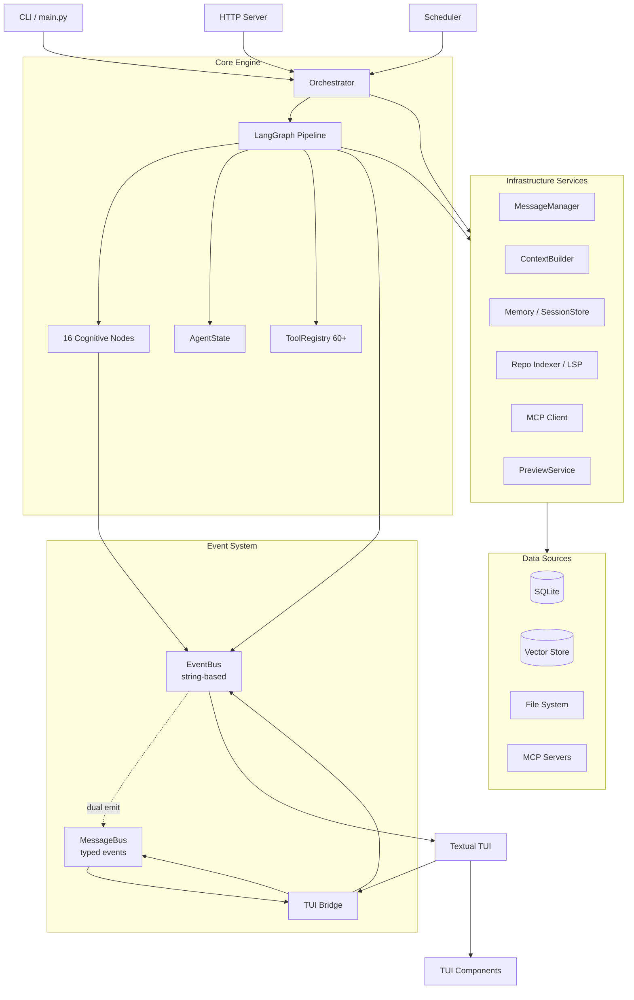
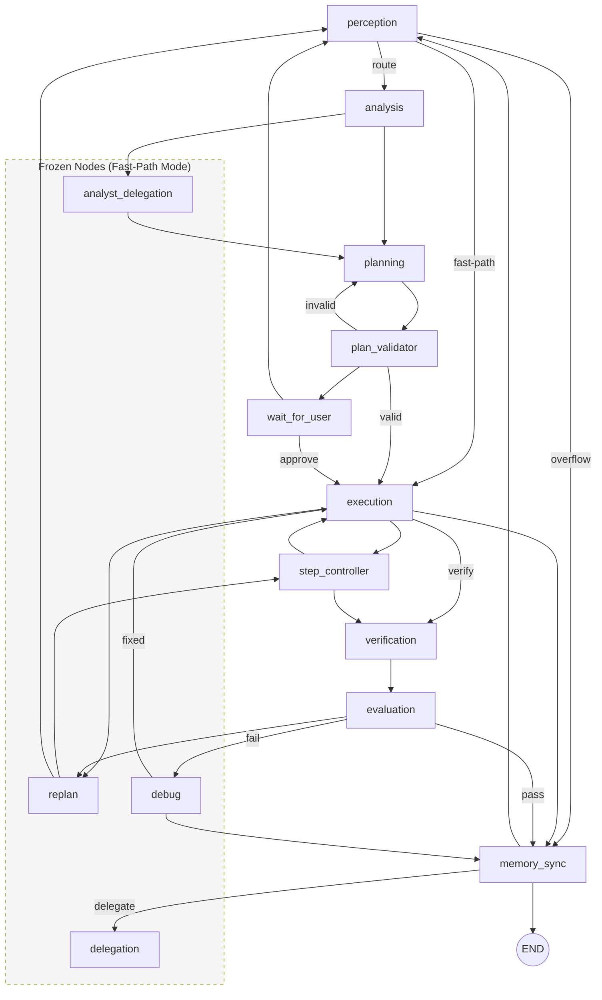

# CodingAgent Architecture

Single source of truth for the system architecture. Supersedes `docs/ARCHITECTURE_FLOWS.md`, `docs/codingagent-architecture.md`, and `docs/architecture/MESSAGE_BUS.md`.

---

## System Overview



---

## Code Layout — Exhaustive File Tree

All `.py` files in `src/` and `tui/tui_src/`, organized by directory with descriptions for every file.

### `src/main.py`

CLI entry point. `fire`-based command dispatch, wires Orchestrator, TUI, HTTP server, scheduler.

### `src/config/`

```
config/
├── __init__.py             # Package init
├── agent_brain.py          # SOUL prompt, role definitions, skill prompts
├── defaults.py             # Default config values
├── models.py               # Model config dataclasses
├── providers.py            # Provider configuration loading
├── providers.json          # Provider definitions (cloud + local)
├── settings.py             # Settings loading from env/files
└── toolsets/
    └── loader.py           # Toolset configuration loader
```

### `src/tools/`

45 files. Tool decorator, registry, and 50+ agent-visible tools. Internal helpers prefixed with `_`.

```
tools/
├── __init__.py             # Public tool API, re-exports
├── _approval.py            # Approval gate constants for bash/tool tier-3
├── _bash_exec.py           # Bash execution tools: bash(), bash_readonly()
├── _diff_gate.py           # Diff preview gate threading state
├── _edit_tools.py          # Edit tools: edit_file, fuzzy_find, multiedit
├── _file_io.py             # File I/O: read, write, list, delete, glob
├── _lint_verify.py         # Pre-write lint verification helper
├── _path_utils.py          # Path-safety utilities (_safe_resolve)
├── _registry.py            # Tool auto-discovery and registration
├── _result.py              # Structured ToolResult dataclass
├── _security.py            # Shell command security constants
├── _tool.py                # @tool decorator and metadata
├── _truncate.py            # Centralised tool-output truncation
├── _workspace_guard.py     # WorkspaceGuard re-export with fallback
├── ast_tools.py            # AST rename and list-symbols for Python
├── bash_security.py        # AST-level bash command risk analysis
├── batch_tools.py          # Parallel asyncio.gather tool execution
├── file_lock.py            # Cross-platform advisory file locking
├── file_tools.py           # Compatibility re-exports for file/shell tools
├── formatter.py            # Auto-formatter hook for file writes
├── git_tools.py            # Git integration: commit, diff, stash, log
├── guardrails.py           # Read-before-write enforcement
├── interaction_tools.py    # ask_user, ask_user_yes_no, attempt_completion
├── lint_dispatch.py        # Post-write quick-lint dispatcher
├── lsp_tools.py            # LSP-backed tools: go-to-def, references, hover
├── memory_tools.py         # memory_search, memory_store tools
├── patch_tools.py          # Unified-diff patch application
├── permission_context.py   # --allowed-tools / --deny-tool filtering
├── plan_mode_tools.py      # plan_enter / plan_exit mode transitions
├── project_tools.py        # Tech-stack detection, manifest scanning
├── repo_read_tools.py      # Read-only repo analysis: overview, filemap
├── repo_write_tools.py     # Write-side repo tools: initialize intelligence
├── role_tools.py           # In-memory role getter/setter
├── rollback_tools.py       # Filesystem snapshot and undo
├── sandbox.py              # Sandboxed subprocess (bwrap / sandbox-exec)
├── skill_tools.py          # load_skill tool for skill prompt retrieval
├── state_tools.py          # Agent state inspection and modification
├── subagent_payloads.py    # Subagent role normalization helpers
├── subagent_tools.py       # Subagent spawn/delegate tools
├── symbol_reader.py        # Function/class-level code reading
├── system_tools.py         # System info tools
├── todo_tools.py           # TODO.md task tracking
├── tools_config.py         # Configurable tool values
├── verification_tools.py   # Test/verification execution tools
└── web_tools.py            # web_search and read_web_page tools
```

### `src/core/`

Top-level core modules (not in sub-packages).

```
core/
├── __init__.py             # Package init
├── config_loader.py        # Configuration loading and merging
├── credentials.py          # Credential management (API keys, tokens)
├── env_registry.py         # Environment variable registry
├── env_shims.py            # Environment compatibility shims
├── errors.py               # Core error types
├── interfaces.py           # Core interface definitions
├── io_utils.py             # I/O utility functions
├── logger.py               # Logging infrastructure
├── paths.py                # Path resolution utilities
└── startup.py              # Application startup sequence
```

### `src/core/orchestration/`

LangGraph pipeline, EventBus, orchestrator, and supporting services (71 top-level files).

```
core/orchestration/
├── _protocols.py               # Structural protocols to avoid circular imports
├── agent_brain.py              # AgentBrainManager — brain config caching
├── agent_hooks.py              # Agent lifecycle hook system
├── agent_session_manager.py    # Session lifecycle management
├── agent_types.py              # Agent type definitions
├── approval_gate.py            # Approval gate for tool execution
├── commands.py                 # Orchestrator command handling
├── context_manager.py          # Context window management
├── cross_session_bus.py        # Cross-session event bus
├── dag_parser.py               # DAG parsing for multi-step plans
├── deferred_init.py            # Deferred initialization pattern
├── event_bus.py                # EventBus — thread-safe, dual-emission
├── event_log.py                # Event logging/persistence
├── event_persistence.py        # Event persistence to store
├── execution_trace.py          # Execution trace recording
├── file_lock_manager.py        # Cross-process file lock coordinator
├── git_worktree_manager.py     # Git worktree management
├── graph_factory.py            # LangGraph graph factory
├── inference_loop.py           # Main inference loop (outer loop)
├── inference_loop_responses.py # Response-building helpers
├── inference_loop_rounds.py    # Graph-round execution helpers
├── inference_loop_state.py     # Initial-state and turn-budget helpers
├── instruction_loader.py       # Instruction file loading
├── loop_guards.py              # Loop termination / guard conditions
├── mcp_stdio_server.py         # MCP stdio server launcher
├── message_manager.py          # Message lifecycle manager
├── orchestrator.py             # Main Orchestrator class
├── orchestrator_bootstrap.py   # Orchestrator bootstrap sequence
├── orchestrator_config_reload.py # Config hot-reload handler
├── orchestrator_event_subscriptions.py # Event subscription wiring
├── orchestrator_helpers.py     # Orchestrator helper utilities
├── orchestrator_provider_init.py   # Provider initialization
├── orchestrator_scheduler.py   # Orchestrator scheduler integration
├── orchestrator_services_init.py   # Services initialization
├── permission_gateway.py       # Permission check gateway
├── permission_policy.py        # Permission policy engine
├── permission_table.py         # Permission table data
├── plan_mode.py                # Plan mode state management
├── preview_coordinator.py      # Preview coordination
├── preview_service.py          # Preview/diff generation service
├── project_settings.py         # Project-level settings
├── prompt_injection_guard.py   # Prompt injection detection
├── provider_capabilities.py    # Provider capability discovery
├── prsw_topics.py              # PRSW (Parallel Read/Seq Write) topics
├── registry_builder.py         # Tool/component registry building
├── remote_skills.py            # Remote skill loading
├── role_config.py              # Role configuration
├── rollback_manager.py         # Rollback management
├── session_cost_tracker.py     # Session cost tracking
├── session_lifecycle.py        # Session lifecycle events
├── session_manager.py          # Session manager
├── session_registry.py         # Session registry
├── session_store.py            # Session storage
├── session_watcher.py          # Session file watcher
├── shell_hooks.py              # Shell event hooks
├── snapshot_manager.py         # File system snapshot manager
├── task_lifecycle.py           # Task lifecycle management
├── token_budget.py             # Token budget tracking
├── tool_constants.py           # Tool-related constants
├── tool_contracts.py           # Tool contract definitions
├── tool_execution_pipeline.py  # Tool execution pipeline
├── tool_execution_service.py   # Tool execution service
├── tool_hooks.py               # Tool execution hooks
├── tool_parser.py              # Tool call parsing from LLM output
├── tool_preflight.py           # Pre-flight tool checks
├── tool_registry.py            # Tool registry
├── tool_result_formatter.py    # Tool result formatting
├── wave_coordinator.py         # PRSW wave execution coordinator
├── work_summary.py             # Work summary generation
└── workspace_guard.py          # Workspace access guard
```

### `src/core/orchestration/graph/`

LangGraph state graph: routing logic, state definition, builder. No `__init__.py`.

```
core/orchestration/graph/
├── analysis_routing.py      # analysis → planning/analyst_delegation routing
├── builder.py               # LangGraph graph builder (wires all nodes)
├── execution_routing.py     # Tool execution lifecycle routing
├── perception_routing.py    # Perception → analysis/fast-path/overflow routing
├── planning_routing.py      # Plan validation and approval routing
├── session_routing.py       # Session lifecycle routing
├── state.py                 # AgentState — shared LangGraph state
└── tier_graph_routing.py    # Model-tier-aware graph routing
```

### `src/core/orchestration/graph/nodes/`

37 LangGraph cognitive-pipeline node implementations. One file per node or node concern.

```
core/orchestration/graph/nodes/
├── analysis_node.py             # analysis — code understanding
├── analyst_delegation_node.py   # analyst_delegation — deep analysis subagent
├── debug_node.py                # debug — error investigation
├── delegation_node.py           # delegation — task delegation to subagents
├── evaluation_node.py           # evaluation — result assessment
├── execution_dispatch.py        # Tool dispatch from execution node
├── execution_guards.py          # Execution guard checks
├── execution_helpers.py         # Shared execution utilities
├── execution_lifecycle.py       # Tool lifecycle hooks during execution
├── execution_node.py            # execution — tool call dispatch
├── execution_parsing.py         # Tool call parsing during execution
├── execution_plan.py            # Execution plan building
├── execution_preflight.py       # Pre-execution checks
├── execution_tool.py            # Single tool execution
├── frontier_loop_node.py        # frontier_loop — frontier model loop
├── memory_update_node.py        # Memory update operations
├── node_utils.py                # Shared node utilities
├── perception_compaction.py     # Context compaction in perception
├── perception_messages.py       # Message handling in perception
├── perception_node.py           # perception — input processing
├── perception_no_tool.py        # No-tool path in perception
├── perception_parsing.py        # Input parsing in perception
├── perception_post_call.py      # Post-LLM-call perception processing
├── perception_result.py         # Perception result handling
├── perception_retrieval.py      # Context retrieval in perception
├── perception_runtime.py        # Runtime checks in perception
├── plan_validator_node.py       # plan_validator — plan validation
├── planning_fast_paths.py       # Fast-path planning
├── planning_helpers.py          # Shared planning utilities
├── planning_node.py             # planning — plan generation
├── planning_prompt.py           # Planning prompt construction
├── planning_result.py           # Planning result handling
├── replan_node.py               # replan — plan revision
├── step_controller_node.py      # step_controller — step sequencing
├── tool_output_truncation.py    # Tool output truncation logic
├── verification_node.py         # verification — result checking
└── wait_for_user_node.py        # wait_for_user — user input/approval
```

### `src/core/messaging/`

Typed event system — MessageBus, event classes, adapters, infrastructure.

```
core/messaging/
├── __init__.py              # Lazy re-exports via __getattr__
├── bus.py                   # MessageBus — typed async delivery
├── event_types.py           # 90+ typed event dataclasses
├── events.py                # Base Event class
└── metrics.py               # MessageBus metrics collection
```

### `src/core/inference/`

LLM inference layer — 27 top-level files + 10 adapters.

```
core/inference/
├── __init__.py                  # Package init
├── _protocols.py                # Structural protocols for inference layer
├── adapter_wrappers.py          # Adapter call wrappers
├── call_postprocess.py          # Post-call response processing
├── hardware_capability_profile.py # Hardware capability detection
├── kv_cache_governor.py         # KV cache management
├── llm_client.py                # Abstract LLM client base
├── llm_helpers.py               # LLM helper utilities
├── llm_manager.py               # LLM Manager — provider registry, model discovery
├── model_cache.py               # Model response caching
├── model_capability_profile.py  # Model capability profiles
├── model_selection.py           # Model selection/routing
├── model_tiers.py               # Tier classification (NANO–FRONTIER)
├── provider_config.py           # Provider configuration
├── provider_context.py          # Provider context management
├── provider_discovery.py        # Provider auto-discovery
├── provider_fallback.py         # Cross-provider graceful fallback
├── provider_loading.py          # Provider dynamic loading
├── provider_probe.py            # Provider capability probing
├── provider_utils.py            # Shared provider utilities
├── runtime_call.py              # Runtime LLM invocation
├── runtime_profile.py           # Runtime performance profiling
├── streaming.py                 # Response streaming
├── telemetry.py                 # Inference telemetry
├── thinking_utils.py            # Chain-of-thought utilities
├── tokenizer.py                 # Token counting/encoding
├── workflow_selector.py         # Workflow/strategy selection
└── adapters/
    ├── anthropic_adapter.py         # Anthropic API adapter
    ├── github_copilot_adapter.py    # GitHub Copilot adapter
    ├── github_copilot_auth.py       # GitHub Copilot auth flow
    ├── groq_adapter.py              # Groq adapter
    ├── litellm_adapter.py           # LiteLLM unified adapter
    ├── lm_studio_adapter.py         # LM Studio adapter
    ├── mock_adapter.py              # Mock adapter for testing
    ├── ollama_adapter.py            # Ollama adapter
    ├── openai_compat_adapter.py     # OpenAI-compatible adapter
    └── openrouter_adapter.py        # OpenRouter adapter
```

### `src/core/memory/`

Session persistence, memory tools, compaction/distillation (20 files).

```
core/memory/
├── _write_retry_utils.py       # Retry logic for store writes
├── abstract_session_store.py   # Abstract session store interface
├── advanced_features.py        # Advanced store features
├── auto_compactor.py           # Automatic context compaction
├── compaction_service.py       # Compaction service
├── distiller.py                # Memory distillation (summarization)
├── file_lock.py                # File-based locking
├── frozen_snapshot.py          # Frozen state snapshots
├── jsonl_session_store.py      # JSONL-backed session store
├── jsonl_sidecar_io.py         # JSONL sidecar file I/O
├── jsonl_store_helpers.py      # JSONL store utilities
├── memory_tools.py             # Memory tool implementations
├── security.py                 # Memory security checks
├── session_store.py            # Session store (dispatches to impl)
├── sqlite_session_store.py     # SQLite-backed session store
├── sqlite_store_collaborators.py # SQLite store collaborator ops
├── sqlite_store_queries.py     # SQLite query definitions
├── sqlite_store_schema.py      # SQLite schema management
├── sqlite_store_session_ops.py # SQLite session operations
└── sqlite_store_sidecar.py     # SQLite sidecar operations
```

### `src/core/context/`

Context building, prompt assembly, message management (12 files).

```
core/context/
├── agent_brain_loading.py      # Agent brain configuration loading
├── context_builder.py          # ContextBuilder — prompt assembly
├── context_controller.py       # Context window controller
├── instruction_files.py        # Instruction file handling
├── message_assembly.py         # Message list assembly
├── prompt_blocks.py            # Reusable prompt block definitions
├── prompt_cache.py             # Prompt template caching
├── retrieved_snippets.py       # Retrieved snippet management
├── sanitization.py             # Input sanitization
├── static_prompt_parts.py      # Static prompt components
├── token_truncation.py         # Token budget truncation
└── tool_output_pruning.py      # Tool output pruning strategies
```

### `src/core/indexing/`

Repository indexing, symbol graph, LSP integration (6 files, no subdirectories).

```
core/indexing/
├── lsp_client.py           # LSP protocol client
├── lsp_context.py          # LSP context management
├── lsp_manager.py          # LSP manager — lifecycle
├── repo_indexer.py         # Repository indexing
├── symbol_graph.py         # Symbol dependency graph
└── vector_store.py         # Vector store for code embeddings
```

### `src/core/mcp/`

MCP (Model Context Protocol) client infrastructure (6 files).

```
core/mcp/
├── __init__.py             # Package init
├── manager.py              # MCP server manager
├── mcp_client.py           # Base MCP client
├── mcp_http_client.py      # HTTP-based MCP client
├── mcp_sse_client.py       # SSE-based MCP client
└── mcp_ws_client.py        # WebSocket-based MCP client
```

### `src/server/`

HTTP/SSE server for remote agent access (11 files).

```
server/
├── __init__.py             # Package init
├── app.py                  # FastAPI application
├── event_delivery.py       # Server-sent event delivery
├── event_subscriptions.py  # Event subscription management
├── metrics.py              # Server metrics
├── scheduler_endpoints.py  # Scheduler API endpoints
├── server_config.py        # Server configuration
├── sse_adapter.py          # SSE adapter
├── task_endpoints.py       # Task API endpoints
├── websocket_control.py    # WebSocket control messages
└── websocket_handler.py    # WebSocket connection handler
```

### `tui/tui_src/ui/`

Textual TUI application. 28 top-level files plus subdirectories. `tui/src/ui/` mirrors `tui/tui_src/ui/`.

```
tui/tui_src/ui/
├── __init__.py                     # UI package init
├── _app_message_handlers_mixin.py  # Streaming/message/chat-input handlers
├── _app_protocol.py                # AgentApp protocol definition
├── _app_session_mixin.py           # Session lifecycle mixin
├── _app_slash_commands_mixin.py    # /-command handlers
├── _app_status_handlers_mixin.py   # Token/context/provider notification handlers
├── _app_tool_handlers_mixin.py     # Tool-call/subagent/diff/plan handlers
├── _bridge_agent.py                # Bridge agent interface
├── _bridge_context.py              # Bridge context management
├── _bridge_protocol.py             # Bridge protocol definitions
├── _bridge_provider.py             # Bridge provider interface
├── _bridge_session.py              # Bridge session management
├── _bridge_subscriptions.py        # Typed event routing table
├── _bridge_tools.py                # Bridge tool interface
├── _core_paths_loader.py           # Core path configuration loader
├── app.py                          # AgentApp (Textual App subclass)
├── bus.py                          # Event bus adapter/proxy
├── config_writer.py                # Config file writer
├── controller.py                   # TUI controller logic
├── coordinator.py                  # TUI coordinator
├── core_bridge.py                  # Bridge — MessageBus subscriber
├── events.py                       # TUI event types
├── logging.py                      # TUI logging
├── main.py                         # TUI entry point
├── mock_engine.py                  # Mock backend engine for dev
├── mock_eventbus.py                # Mock event bus for testing
├── settings.py                     # TUI settings
└── widgets.py                      # Shared widget utilities
```

### `tui/tui_src/ui/screens/`

Full-screen views for the TUI.

```
tui/tui_src/ui/screens/
├── __init__.py             # Package init
├── probe_results.py        # Provider probe results screen
├── session_list.py         # Session list screen
├── session_screen.py       # Main chat session screen
├── subagent_detail.py      # Subagent detail view
└── timeline.py             # Event timeline screen
```

### `tui/tui_src/ui/components/`

Reusable TUI widgets and mixins.

```
tui/tui_src/ui/components/
├── __init__.py             # Package init
├── artifact.py             # Artifact display component
├── bash_block.py           # Bash command output block
├── cards.py                # Card layout components
├── chat_input.py           # Chat input area
├── chat_mixin.py           # Chat display mixin
├── console.py              # Console output component
├── diff_viewer.py          # Diff display viewer
├── file_picker.py          # File picker component
├── history_input.py        # Command history input
├── inline_tool.py          # Inline tool display
├── status_bar.py           # Status bar component
├── stream_view.py          # Streaming text view
├── subagent_progress.py    # Subagent progress indicator
├── thinking.py             # Thinking/chain-of-thought display
└── todo_list.py            # TODO list display
```

### `tui/tui_src/ui/commands/`

Command system for slash-commands.

```
tui/tui_src/ui/commands/
├── __init__.py             # Package init
└── registry.py             # Command registry
```

### `tui/tui_src/ui/features/`

Optional feature modules (settings, palette, OAuth).

```
tui/tui_src/ui/features/
├── __init__.py             # Package init
├── oauth/
│   ├── __init__.py
│   └── screen.py           # OAuth authentication screen
├── palette/
│   ├── __init__.py
│   ├── logic.py             # Palette command logic
│   └── screen.py            # Command palette screen
└── settings/
    ├── __init__.py
    └── screen.py            # Settings screen
```

---

## Cognitive Pipeline

The pipeline is a LangGraph state machine with 16 nodes and conditional routing.



### Pipeline Paths

```
Fast-path (stabilization): perception → analysis/planning → plan_validator
                           → wait_for_user/execution → step_controller
                           → verification → evaluation → memory_sync
Full:     perception → analysis → planning → plan_validator → execution → verification → evaluation → memory_sync
Frontier: perception → frontier_loop → verification → evaluation → memory_sync
Overflow: perception → memory_sync → perception (context compaction)
```

### Fast-Path Stabilization Mode

**Status: ACTIVE (June 2026)**

The codebase is in Fast-Path stabilization mode. A compile-time flag `_USE_FULL_GRAPH` in `src/core/orchestration/graph/builder.py` controls which graph is active:

- `_USE_FULL_GRAPH = False` (default) — The 10-node Fast-Path compiles: `perception`, `analysis`, `planning`, `plan_validator`, `wait_for_user`, `execution`, `step_controller`, `verification`, `evaluation`, and `memory_sync`. `replan`, `debug`, `delegation`, and `analyst_delegation` remain frozen; their routes use explicit fallbacks.
- `_USE_FULL_GRAPH = True` — All 16 nodes are active (original full graph).

The approval boundary is present in both graph variants: routes that require user approval must enter `wait_for_user`, never jump directly to `execution`.

To re-enable a frozen node, switch `_USE_FULL_GRAPH = True` and verify against all contract tests in `tests/unit/test_fast_path_locks.py` and `tests/unit/test_fast_path_event_ordering.py`.

---

## Event System

Two cooperating buses:

```
                           EventBus.publish("name", dict)
                                    │
                        ┌───────────┴───────────┐
                        │                       │
                   old subscribers      _build_typed_event()
                        │                  │
                        │         EVENT_NAME_TO_TYPED[90+]
                        │                  │
                        │            typed event class
                        │                  │
                        └──────────────────┼──┘
                                           │
                                    MessageBus.publish(typed_event)
                                           │
                               sync_queue → bridge → async dispatch
                                           │
                                      run_in_executor
                                           │
                                   handler.handle(event)
```

- **EventBus** (`src/core/orchestration/event_bus.py`) — legacy string-addressed bus. `publish("name", dict)` delivers to old subscribers AND auto-emits typed event on MessageBus. `publish_typed(Event(...))` emits on MessageBus AND delivers `to_dict()` to old subscribers.

- **MessageBus** (`src/core/messaging/bus.py`) — typed event delivery with async internals and sync API. Architecture: `sync_queue → bridge → async dispatch → executor threads`. Handlers run via `run_in_executor` so blocking handlers don't block the event loop.

- **TUI Bridge** — subscribes exclusively through MessageBus with `_DictBridgeAdapter` converting typed events to dicts for existing handlers.

### Stabilization Hardening

### FileLockManager — Zombie Lock Prevention

The `FileLockManager` in `src/core/orchestration/file_lock_manager.py` has three layers of defense against zombie locks:

1. **Auto-release timeout guard** — `_auto_release_after_timeout()` starts an `asyncio.Task` when a write lock is acquired. If the lock is not released within the timeout window (default 30s), the guard force-releases it with a `CRITICAL` log entry. This catches hanging executor threads.

2. **Owner-scoped cancel** — `reset_cancel(owner=agent_id)` only clears the cancel signal when the caller matches the original `cancel()` caller. Prevents one coroutine from inadvertently clearing another's cancel.

3. **Singleton reset** — `reset_instance()` replaces the singleton with a fresh instance, cancelling all pending operations on the old one. Called during orchestrator bootstrap (`orchestrator_bootstrap.py`) so TUI reconnection or hot-reload gets a clean lock state.

4. **atexit cleanup** — Registers a process-exit handler that releases all held locks, preventing leaked lock state on SIGTERM/SIGINT.

### Sequenced Dispatch in MessageBus

Critical lifecycle events (ToolExecuteStart/Finish/Error, StepStart/Finish, DelegationStart/Finish) are now delivered in strict FIFO publication order within their category. Per-category `asyncio.Queue` consumer tasks ensure ordering without cross-category blocking.

## Phases Completed

| Phase | Description | Key Change |
|-------|-------------|-----------|
| 1-2 | MessageBus infrastructure + 57 typed event classes | `messaging/bus.py`, `event_types.py` |
| 3 | TUI bridge typed subscriptions | `_bridge_subscriptions.py` routing table |
| 4 | TUI init-once fix, dual-bus reference model | Circular import fixes |
| 5 | DualPublishBus removed, 103 publish sites migrated | `event_bus.py` natively owns MessageBus ref |
| 6 | MessageBus async migration | `sync_queue → bridge → async dispatch` pattern |
| 7 | **Sequenced dispatch (Stabilization Phases 1-4)** | Per-category FIFO queues for tool/step/delegation events. Zombie lock prevention (`reset_instance`, `reset_cancel(owner=)`, auto-release timeout). Per-event-type lazy import (importlib per-symbol). Contract tests (27 new tests). |

### Sequenced Dispatch

Critical lifecycle events (`ToolExecuteStart`, `ToolExecuteFinish`, `ToolExecuteError`, `StepStart`, `StepFinish`, `DelegationStart`, `DelegationFinish`) are delivered to handlers in strict publication order within their category.

This prevents the race where a rapid sequence like `ToolExecuteStart → ToolExecuteFinish` could be delivered out of order by concurrent executor threads.

Categories are independent: tool events, step events, and delegation events each have their own FIFO dispatch queue. A slow tool handler does not block delegation events.

Non-sequenced events (token budgets, log entries, UI notifications, etc.) continue to use the concurrent dispatch path for throughput.

### Zombie Lock Prevention (Phase 2)

The `file_lock_manager.py` singleton now includes three safeguards against zombie locks:

- **`reset_instance()`** — replaces the singleton with a clean state on orchestrator re-init (TUI reconnect / hot-reload), preventing stale lock tables from blocking new sessions.
- **`reset_cancel(owner=)`** — owner-scoped lock cancellation that only releases locks held by the specified agent ID, preventing cross-coroutine corruption when one agent reconnects while another is active.
- **`_auto_release_after_timeout`** — a background guard thread releases any write lock held longer than 30 seconds, preventing infinite blocking if a process crashes mid-operation.
- **`atexit` cleanup** — releases all locks on process exit.

Call sites updated: `execution_node.py`, `delegation_node.py`, `wave_coordinator.py`, `orchestrator_bootstrap.py`.

### Per-Event-Type Lazy Import (Phase 3)

The old `_get_event_name_map()` in `event_bus.py` imported all 90+ event classes in one monolithic `from ... import (...)` block. If any single class failed to import (renamed, removed, circular import), the entire mapping was lost — no typed events would be emitted.

The new approach stores dotted module paths in `_EVENT_IMPORT_PATHS` and imports each class lazily via `importlib.import_module()` on first use in `_build_typed_event()`. A failed import for `"tool.execute.start"` logs a warning at the `_logger.warning` level but does not affect `"session.created"` or any other event.

Similarly, `_bridge_subscriptions.py` previously used a `from src.core.messaging import (A, B, C, ...)` block wrapped in a blanket `except Exception: pass`. Now each symbol is resolved individually via `_resolve_event_class()`, and `TYPED_EVENT_ROUTING` stores class name strings instead of class references. A missing symbol (e.g., a renamed event) logs a per-symbol warning and skips only that subscription.

`_build_typed_event` field-mismatch errors are also logged at `_logger.warning` (upgraded from `debug`) so silent event drops are visible in production logs.

### Phase 4 — `_reset_cancel(owner=)` Bugfix

During Phase 4 contract testing, a bug was found and fixed in `FileLockManager.reset_cancel()` (`src/core/orchestration/file_lock_manager.py:252`). When `reset_cancel()` was called without an `owner` argument (or with `owner=None`), the guard condition `owner is not None and self._cancel_owner is not None` short-circuited to `False` and the cancel signal was cleared even when an owner was set. **Fixed to**: `if self._cancel_owner is not None: if owner is None or owner != self._cancel_owner: return`.

### Contract Tests (Phase 4)

Two dedicated contract test files verify the stabilization guarantees are met:

- **`test_fast_path_locks.py`** (17 tests) — Singleton reset isolation, owner-scoped cancel/reset_cancel, auto-release timeout, atexit registration.
- **`test_fast_path_event_ordering.py`** (10 tests) — FIFO ordering per category (tool, step, delegation), cross-category independence with interleaved publishes, multi-pair sequencing.

### Event Mapping

The `_EVENT_IMPORT_PATHS` table in `event_bus.py` maps 90+ string event names to module paths and class names. Each entry may include a field mapper for camelCase → snake_case conversion. Key categories:

| Category | Count | Examples |
|----------|-------|---------|
| Agent lifecycle | 7 | AgentStart, AgentEnd, AgentStatus, AgentMessage |
| Tool execution | 7 | ToolExecuteStart, ToolInvoked, ToolExecuteFinish |
| Session | 8 | SessionCreated, SessionHydrated, SessionNew |
| Provider / model | 12 | ProviderStatusChanged, ProviderModelsList, ModelRouting |
| Context / memory | 7 | ContextOverflow, ContextCompacted, MessageTruncation |
| Token budget | 4 | TokenBudget, TokenBudgetWarning, UsageTurnSummary |
| File system | 3 | FileModified, FileDeleted, FileDiffPreview |
| Delegation | 3 | DelegationStart, DelegationFinish, DelegationComplete |
| Retry | 3 | RetryAttempt, RetrySucceeded, RetryFailed |
| MCP / config | 4 | McpServerStatus, McpToolsListChanged, ConfigReloaded |
| Orchestrator | 4 | OrchestratorStartup, ModelsCheckStarted/Completed/Failed |
| UI / notifications | 4 | UiNotification, HookMessage, LogEntry, GitBranch |
| Scheduler | 2 | SchedulerDistillRequest, SchedulerDistillCompleted |
| Perception | 1 | PerceptionCorrectivePrompt |
| Task | 2 | TaskQueueUpdated, TaskTurnLimit |
| Step | 2 | StepStart, StepFinish |
| Role | 1 | RoleTransition |

---

## Component Overview

| Component | File | Purpose |
|-----------|------|---------|
| Orchestrator | `src/core/orchestration/orchestrator.py` | Main agent class |
| Graph Builder | `src/core/orchestration/graph/builder.py` | LangGraph compilation |
| EventBus | `src/core/orchestration/event_bus.py` | Thread-safe event bus + typed dual-emission |
| MessageBus | `src/core/messaging/bus.py` | Typed event delivery with error isolation |
| Tool Registry | `src/tools/_registry.py` | Tool auto-discovery |
| Context Builder | `src/core/context/context_builder.py` | Prompt building |
| Model Tiers | `src/core/inference/model_tiers.py` | Tier classification |
| TUI Bridge | `tui/src/ui/core_bridge.py` | TUI-backend connectivity |
| Session Store | `src/core/memory/session_store.py` | SQLite persistence |

---

## Inference Flow

Every LLM invocation passes through:

```
call_model() → ProviderManager → AdapterWrapper.generate()
    → Tier classification → Context budget → Tokenizer / prune → LLM HTTP call
    → Response parsing (tool_parser.py) → Result → AgentState
```

Model tiers adapt the pipeline:

| Tier | Params | Tools | Format |
|------|--------|-------|--------|
| NANO | ≤7B | 8 | YAML |
| SMALL | 7-14B | 20 | YAML |
| MEDIUM | 14-70B | 35 | JSON |
| LARGE | >70B | 50 | JSON |
| FRONTIER | Cloud | 60 | JSON |

---

## Agent Delegation

`delegate_task()` spawns a child orchestrator in a dedicated thread with its own LangGraph session. Roles map to tool subsets:

| Role | Purpose | Toolset |
|------|---------|---------|
| analyst | Deep code analysis | read, grep, glob, AST |
| operational | File operations, refactoring | write, edit, bash, git |
| strategic | Planning, task breakdown | analysis + planning tools |
| reviewer | Code review, quality checks | read, diff, git |
| debugger | Error investigation | read, grep, bash, test |

---

## Key Architectural Patterns

1. **Typed events** — always use `publish_typed(EventClass(...))` for new code. Event fields use `kw_only=True` on base fields so subclasses have required positional fields.

2. **Thread safety** — EventBus uses `threading.RLock()`, session store uses `threading.local()`. Correlation IDs via `ContextVar` propagated across async/thread boundaries via `run_with_correlation()`.

3. **MessageBus async architecture** — `sync_queue` (thread-safe for `publish()`) → `_bridge` task (transfers to event loop) → `_dispatch` tasks (run handlers via `run_in_executor`). Blocking handlers don't block the event loop.

4. **Lazy imports** — used to break circular dependencies (event_types in event_bus, MessageBus in messaging). `messaging/__init__.py` uses `__getattr__` for lazy re-export.

5. **Graceful degradation** — all optional features wrapped in try/except. Missing optional deps → fallback, not failure.

6. **PRSW (Parallel Read, Sequential Write)** — `FileLockManager` coordinates reads as shared + writes as exclusive. Multi-step plans can read in parallel; writes serialize.

7. **Multi-layer security** — 5 layers: pattern block, restricted commands, AST analysis, approval gate, plan mode blocking. Read-before-write enforcement.

8. **Tier-adaptive pipeline** — `ModelTier` gates tool count, prompt format, plan step limit, max turns, context fraction. Same graph runs NANO and FRONTIER.

---

## Related Documents

| Document | Description |
|----------|-------------|
| `AGENTS.md` | Agent instructions, conventions, operational context |
| `README.md` | Quick start, CLI usage, configuration |
| `docs/developer-guide.md` | Development guide |
| `docs/DEVELOPMENT.md` | Developer onboarding |
