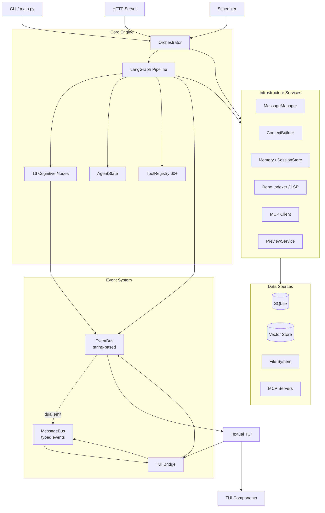
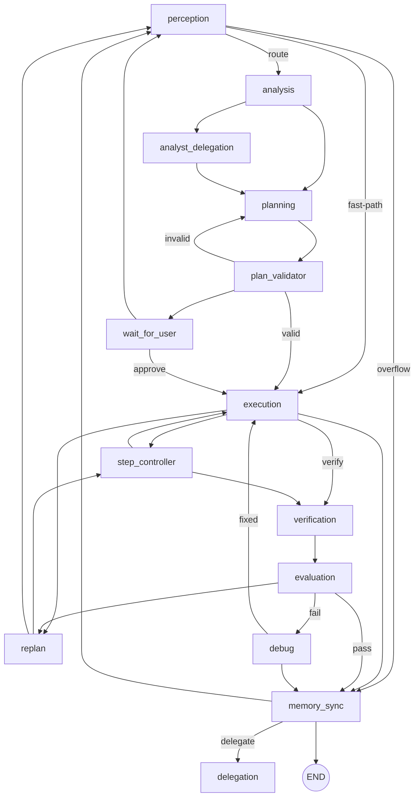

# CodingAgent

A local-first autonomous coding agent built on LangGraph. Runs on local LLMs (LM Studio, Ollama) or cloud providers (OpenRouter, OpenAI, Anthropic, GitHub Copilot, Groq, LiteLLM). No cloud dependency required.

## Features

- **LangGraph pipeline** — 16-node cognitive pipeline (perception → analysis → planning → execution → verification → evaluation)
- **60+ tools** — auto-discovered via `@tool` decorator: file ops, git, web, AST, repo search, verification, memory, subagents
- **Production TUI** — Textual-based terminal UI with streaming, per-tool icons, diff preview, slash commands
- **Multi-agent delegation** — `delegate_task` spawns role-specific subagents (analyst, operational, strategic, reviewer, debugger)
- **Security** — bwrap sandbox, 3-tier bash allowlist, workspace scope guard, read-before-write enforcement
- **Memory** — SQLite session store, vector store-based semantic search, context distiller, auto-compactor
- **Repository intelligence** — SHA-256 incremental indexing, symbol graph, semantic code search
- **Model tiers** — NANO (8 tools) → FRONTIER (60 tools) based on model capability
- **Session fork/revert** — branch sessions for experimental changes

## Requirements

Python 3.11+

## Quick Start

```bash
# Install
python3.11 -m venv .venv
source .venv/bin/activate
pip install -e .

# Run TUI (recommended)
python -m src.main

# Headless mode
python -m src.main --task "fix the bug" --workdir /path/to/repo
```

## Configuration

Edit `src/config/providers.json`:

```json
[
  {
    "name": "lm_studio",
    "type": "lm_studio",
    "base_url": "http://localhost:1234/v1",
    "models": ["gemma-4-e4b-it"],
    "active": true
  }
]
```

Supported: `lm_studio`, `ollama`, `openrouter`, `openai`, `anthropic`, `github_copilot`, `groq`, `litellm`

## CLI Usage

```bash
# Basic usage
python -m src.main --task "your task"

# Resume session
python -m src.main --resume-session <session_id> --task "continue"

# Dry run (preview only)
python -m src.main --dry-run --task "refactor"

# Output formats
python -m src.main --task "fix bug" --output-format json
```

## Architecture

### System Overview



### Event System Architecture

The event system has two cooperating buses. Phase 5 eliminated the separate `DualPublishBus` adapter by folding dual-emission directly into `EventBus`:

```mermaid
flowchart LR
    %% Backend publishers
    subgraph Publishers["Event Publishers"]
        GN[Graph Nodes]
        TE[Tool Execution]
        SM[Session Manager]
        CFG[Config Watcher]
        ORC[Orchestrator]
    end

    %% EventBus
    subgraph Bus["EventBus (orchestration/event_bus.py)"]
        OLD[String subscribers<br/>publish(\"name\", dict)]
        NEW[Typed emission<br/>publish_typed(Event(...))]
        MAP[EVENT_NAME_TO_TYPED<br/>90+ event mappings]
    end

    %% MessageBus
    MB[MessageBus<br/>typed Event handlers]

    %% Consumers
    subgraph Consumers["Consumers"]
        TUI[Textual TUI Bridge]
        HTTP[HTTP/SSE Server]
        LOG[Logger / Telemetry]
    end

    Publishers --> OLD
    OLD --> MAP -->|auto-build| MB
    NEW --> MB
    MB -->|to_dict| OLD

    MB --> TUI
    MB --> HTTP
    OLD --> LOG
    OLD --> HTTP
```

**Key design points:**
- `EventBus.publish("name", dict)` delivers to old string subscribers **and** auto-emits a typed event on `MessageBus` via `_build_typed_event()`.
- `EventBus.publish_typed(Event(...))` emits on `MessageBus` first, then delivers `event.to_dict()` to old string subscribers.
- The bridge subscribes exclusively through `MessageBus` (typed events), with `_DictBridgeAdapter` converting typed events to dicts for existing handlers.
- `get_event_bus()` returns `EventBus(typed_bus=get_typed_bus())` — no separate adapter wrapper.

### Cognitive Pipeline



### Component Overview

| Component | File | Purpose |
|-----------|------|---------|
| Orchestrator | `src/core/orchestration/orchestrator.py` | Main agent class |
| Graph Builder | `src/core/orchestration/graph/builder.py` | LangGraph compilation |
| EventBus | `src/core/orchestration/event_bus.py` | Thread-safe event bus + typed dual-emission |
| MessageBus | `src/core/messaging/bus.py` | Typed event delivery with error isolation |
| Tool Registry | `src/tools/_registry.py` | Tool auto-discovery |
| Context Builder | `src/core/context/context_builder.py` | Prompt building |
| Model Tiers | `src/core/inference/model_tiers.py` | Tier classification |
| TUI Bridge | `tui/src/ui/core_bridge.py` | TUI-backend connectivity |
| Session Store | `src/core/memory/session_store.py` | SQLite persistence |

### Pipeline Paths

```
Fast-path: perception → analysis → planning → plan_validator → wait_for_user/execution
           → step_controller → verification → evaluation → memory_sync
Full:     perception → analysis → planning → plan_validator → execution → verification → evaluation → memory_sync
Frontier: perception → frontier_loop → verification → evaluation → memory_sync
Overflow: perception → memory_sync → perception (context compaction)
```

The default compiled fast path is a ten-node graph. `replan`, `debug`, `delegation`, and `analyst_delegation` are frozen but selectable; the approval boundary routes through `wait_for_user`, never straight to `execution`.

## Testing

```bash
# Unit tests (no LLM required)
pytest tests/unit -q

# With specific test
pytest tests/unit/test_tools_file_io.py -v

# Benchmark tests
pytest tests/benchmarks -v
```

## Development

### Adding a Tool

```python
from src.tools import tool

@tool(side_effects=["write"], tags=["coding"])
def my_tool(param: str) -> dict:
    """Description shown to the LLM."""
    return {"ok": True, "result": param}
```

### Running Tests

```bash
# All unit tests
pytest tests/unit -q

# Integration tests (requires running provider)
RUN_INTEGRATION=1 pytest tests/integration -q
```

### Code Quality

```bash
# Lint
ruff check src tests

# Type checking
mypy src/server src/core/inference/provider_utils.py src/core/orchestration/tool_contracts.py src/core/orchestration/tool_parser.py --ignore-missing-imports --follow-imports=silent --disable-error-code=import-untyped --no-error-summary
```

CI runs these as fail-closed gates: newly introduced Ruff or mypy errors break the build.

## Documentation

| Document | Description |
|----------|-------------|
| `ARCHITECTURE.md` | **Single source of truth** — system overview, event system, pipeline, component map |
| `AGENTS.md` | Agent instructions, conventions, code layout |
| `docs/DEVELOPMENT.md` | Developer guide |
| `docs/audit/` | Audit reports (vol1–vol33) |
| `docs/TODO_METRICS.md` | How to enable and use TODO metrics (Prometheus) |

## Model Tiers

| Tier | Params | Tools | Max Turns |
|------|--------|-------|-----------|
| NANO | ≤7B | 8 | 15 |
| SMALL | 7-14B | 20 | 25 |
| MEDIUM | 14-70B | 35 | 40 |
| LARGE | >70B | 50 | 60 |
| FRONTIER | Cloud | 60 | 80 |

## Security

5-layer security model:
1. Pattern block (`_BASE_DANGEROUS_PATTERNS`)
2. Restricted commands (approval required)
3. Safe commands (auto-allowed)
4. AST-level analysis (`bash_security.py`)
5. Sandbox (`sandbox.py` with bubblewrap)

## Environment Variables

| Variable | Purpose |
|----------|---------|
| `CODINGAGENT_SANDBOX_LEVEL` | off/workspace/full |
| `CODINGAGENT_TRUSTED` | Skip approval in CI |
| `CODING_AGENT_HTTP_SERVER` | Start HTTP server |

## Test Baseline

- **4642** unit tests passing (1 skipped, 0 xfail/xpass)
- **7** benchmark tests
- **0** Critical issues
- **0** High issues
- CI runs Ruff + mypy as fail-closed gates; the full `tests/unit` suite must pass from a clean environment
