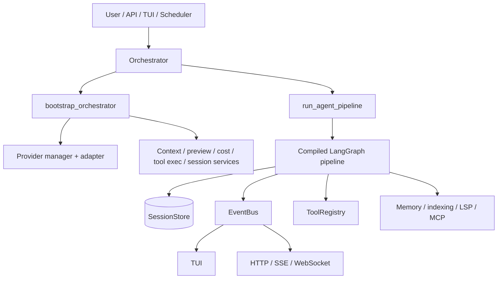
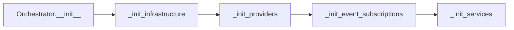
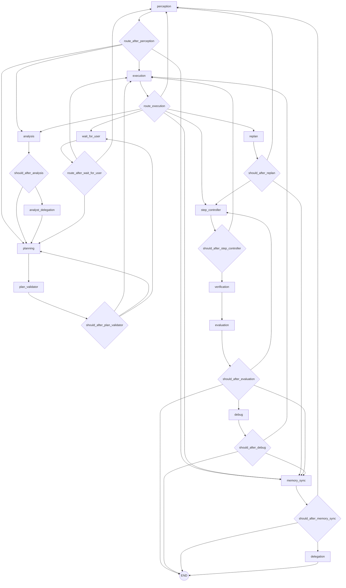
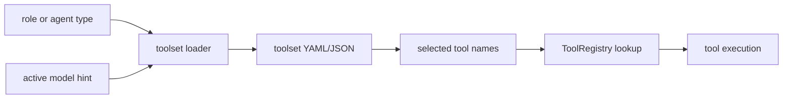
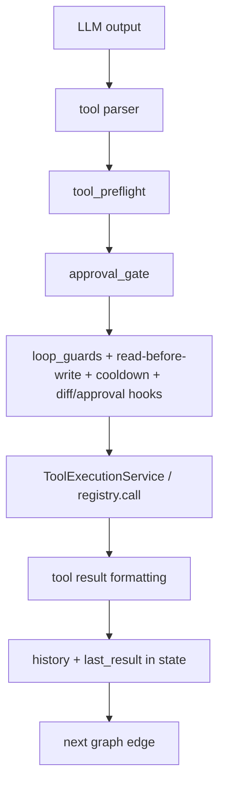
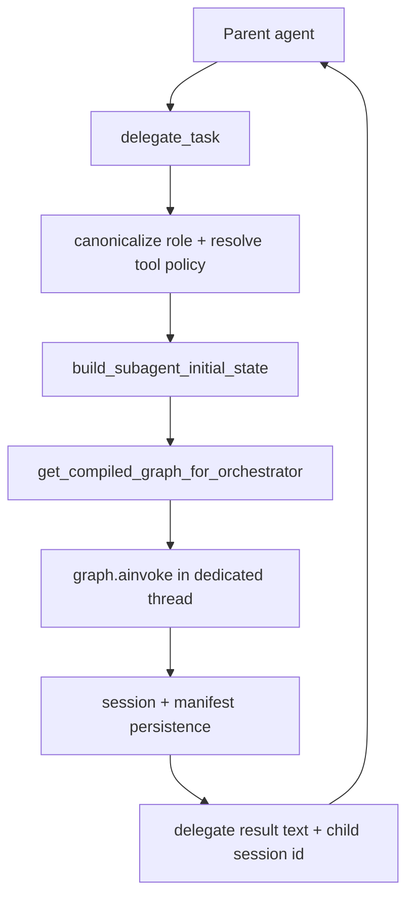
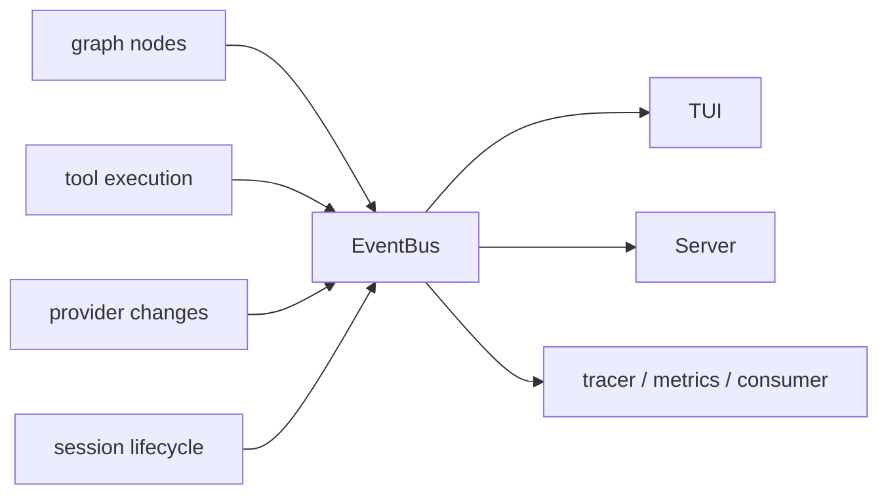

# CodingAgent Orchestration And Tool Flows

Snapshot date: 2026-05-08

This document complements `docs/codingagent-architecture.md` with a flow-first view of the live architecture: orchestration graph shape, delegated subagent execution, tool registry/toolset selection, and runtime service boundaries.

## Positioning

`CodingAgent` is the broader platform-oriented system.

- multi-surface runtime: CLI, TUI, server, scheduler
- larger LangGraph cognitive pipeline
- richer memory, indexing, MCP, and event infrastructure
- stronger long-term fit for general-agent and future autonomous operation

Where `LocalCodingAgent` is the focused local coding specialist, `CodingAgent` is the more general orchestration platform.

## High-Level Runtime



## Bootstrap Flow

`Orchestrator.__init__()` delegates most startup work into `src/core/orchestration/orchestrator_bootstrap.py`.



Bootstrap wires:

- `MessageManager`
- reusable thread pools
- working directory and snapshot managers
- `SessionStore` and lifecycle managers
- provider manager and active adapter
- event subscriptions
- token budget, preview, plan mode, tool execution, MCP, cost tracking services

## Cognitive Graph

The compiled graph is centered in `src/core/orchestration/graph/builder.py`.



## Graph Purpose By Node

| Node | Primary role |
|---|---|
| `perception` | parse the current user turn and infer immediate next action |
| `analysis` | gather repo context, relevant files, symbols, summaries |
| `analyst_delegation` | delegate heavy research-style analysis when needed |
| `planning` | build or revise plan steps / DAG |
| `plan_validator` | validate plan structure and route through approval when needed |
| `execution` | perform tool-driven work or direct action execution |
| `step_controller` | load the next plan step and control progression |
| `verification` | run validation/tests/checks |
| `evaluation` | judge whether work is complete, needs debug, or should continue |
| `debug` | produce repair action after failed verification/evaluation |
| `replan` | reduce/restructure plan after execution failure or complexity mismatch |
| `memory_sync` | persist state/memory and determine whether to delegate or finish |
| `delegation` | terminal fire-and-forget delegation after sync |
| `wait_for_user` | approval/preview/plan-mode stop point |

## Tool Architecture

CodingAgent has two registry surfaces:

- `src/tools/registry.py`
  a tiny legacy-compatible name registry
- `src/tools/_registry.py`
  the real `ToolRegistry` with discovery, aliases, permission semantics, and schema generation

Built-in modules are auto-discovered from the `_BUILTIN_MODULES` list in `src/tools/_registry.py`.

```mermaid
flowchart LR
    ToolModules[file / git / verification / todo / subagent / repo / web / etc.] --> Decorator[@tool]
    Decorator --> ToolDefinition[ToolDefinition metadata]
    ToolDefinition --> Registry[ToolRegistry]
    Registry --> Schemas[OpenAI-compatible schemas]
    Registry --> Calls[registry.call()]
```

## Toolset Flow

Tool exposure is role-aware and model-aware.



Important points:

- `src/config/toolsets/loader.py` is the canonical loader
- YAML is preferred by default and for smaller-model lanes
- JSON is preferred for bigger/frontier lanes when configured
- `task_lifecycle.py` uses model-aware toolset loading when available

## Tool Execution Flow



Common protection layers:

- `tool_preflight.py`
- `approval_gate.py`
- `loop_guards.py`
- permission kinds from tool metadata
- preview mode and diff gating
- write queues and file locking (`FileLockManager`)

## Delegated Subagent Flow

Delegation is primarily implemented through `src/tools/subagent_tools.py`.



Delegation features:

- role canonicalization and aliases
- allow/deny tool policies per delegated role
- optional session resumption via `task_id`
- child session persistence and manifest files
- depth limits to prevent recursion abuse
- ability to inherit parent orchestrator services when available

## State And Persistence

Main state lives in LangGraph `AgentState` (TypedDict-based), with supporting persistence layers:

- `SessionStore`
  transcript and session state persistence
- `.codingAgent/`
  per-workspace runtime state and task artifacts
- memory distillation and sidecar helpers
- snapshot/rollback managers
- event-bus-driven lifecycle hooks

## Eventing And Observability



Key observability pieces:

- `event_bus.py` for in-process correlated events
- `src/core/telemetry/tracer.py`
- `src/core/telemetry/metrics.py`
- `src/core/telemetry/consumer.py`

## Architectural Boundary With LocalCodingAgent

The intended split between the two repositories should now be explicit:

- `LocalCodingAgent`
  focused local coding specialist for Gemma 4 / Qwen 3.5+ and similar local models
- `CodingAgent`
  broader orchestration platform for general-agent behavior, multi-surface runtime, and future autonomous capabilities

That means architectural convergence should favor:

- importing focused simplifications from Local into CodingAgent where complexity is unnecessary
- importing selected metadata/permission/indexing/platform abstractions from CodingAgent into Local where they improve robustness without bloating the local-first runtime
