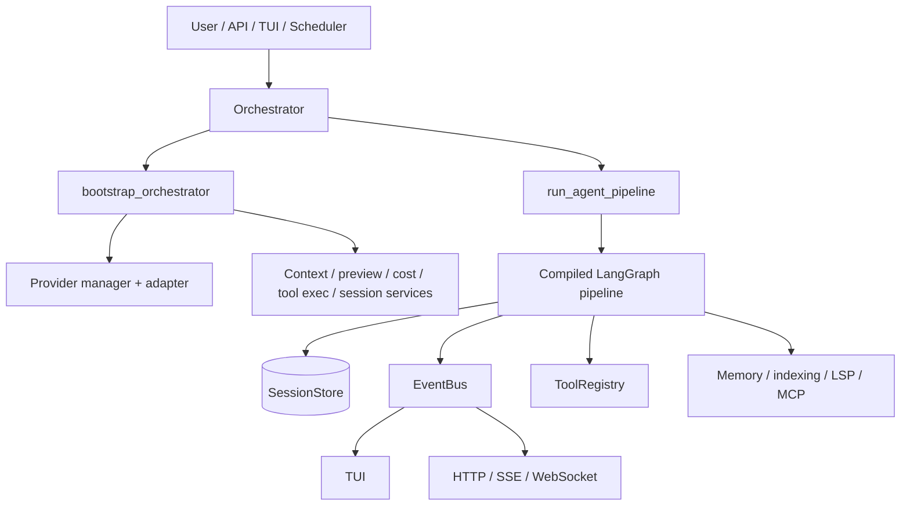
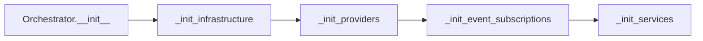
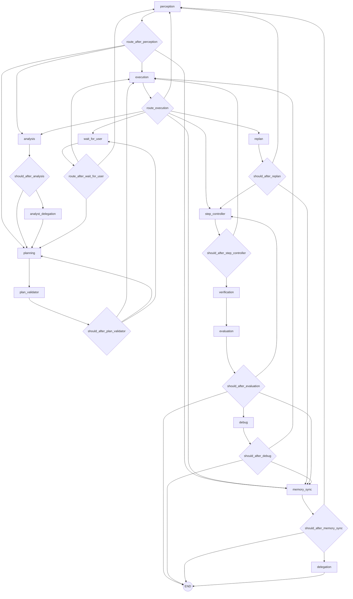
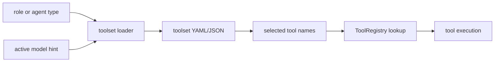
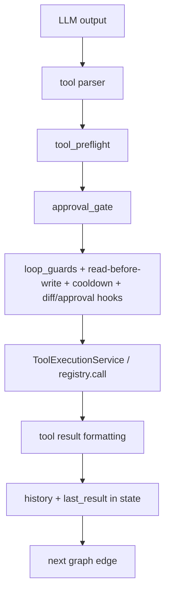
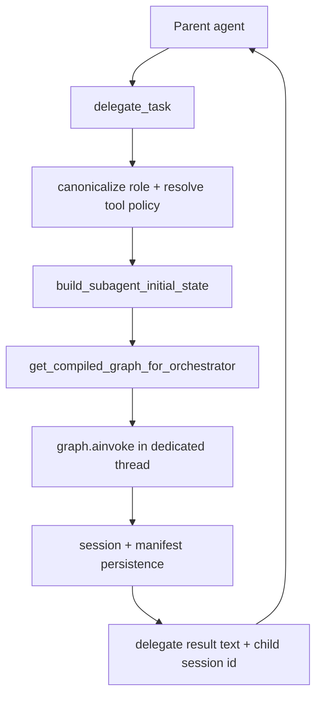
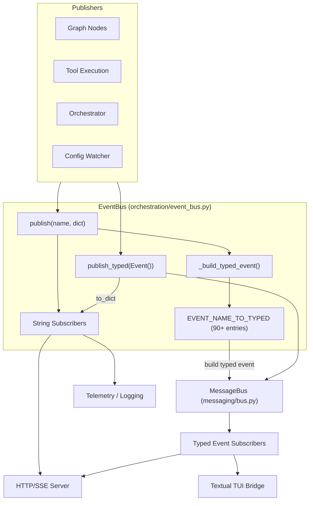

# CodingAgent Orchestration And Tool Flows

Snapshot date: 2026-05-08

This document complements `docs/codingagent-architecture.md` with a flow-first view of the live architecture: orchestration graph shape, delegated subagent execution, tool registry/toolset selection, and runtime service boundaries.

## Positioning

`CodingAgent` is the broader platform-oriented system.

- multi-surface runtime: CLI, TUI, server, scheduler
- larger LangGraph cognitive pipeline
- richer memory, indexing, MCP, and event infrastructure
- stronger long-term fit for general-agent and future autonomous operation

Where `LocalCodingAgent` is the focused local coding specialist, `CodingAgent` is the more general orchestration platform.

## High-Level Runtime



## Bootstrap Flow

`Orchestrator.__init__()` delegates most startup work into `src/core/orchestration/orchestrator_bootstrap.py`.



Bootstrap wires:

- `MessageManager`
- reusable thread pools
- working directory and snapshot managers
- `SessionStore` and lifecycle managers
- provider manager and active adapter
- event subscriptions
- token budget, preview, plan mode, tool execution, MCP, cost tracking services

## Cognitive Graph

The compiled graph is centered in `src/core/orchestration/graph/builder.py`.



## Graph Purpose By Node

| Node | Primary role |
|---|---|
| `perception` | parse the current user turn and infer immediate next action |
| `analysis` | gather repo context, relevant files, symbols, summaries |
| `analyst_delegation` | delegate heavy research-style analysis when needed |
| `planning` | build or revise plan steps / DAG |
| `plan_validator` | validate plan structure and route through approval when needed |
| `execution` | perform tool-driven work or direct action execution |
| `step_controller` | load the next plan step and control progression |
| `verification` | run validation/tests/checks |
| `evaluation` | judge whether work is complete, needs debug, or should continue |
| `debug` | produce repair action after failed verification/evaluation |
| `replan` | reduce/restructure plan after execution failure or complexity mismatch |
| `memory_sync` | persist state/memory and determine whether to delegate or finish |
| `delegation` | terminal fire-and-forget delegation after sync |
| `wait_for_user` | approval/preview/plan-mode stop point |

## Tool Architecture

CodingAgent has two registry surfaces:

- `src/tools/registry.py`
  a tiny legacy-compatible name registry
- `src/tools/_registry.py`
  the real `ToolRegistry` with discovery, aliases, permission semantics, and schema generation

Built-in modules are auto-discovered from the `_BUILTIN_MODULES` list in `src/tools/_registry.py`.

```mermaid
flowchart LR
    ToolModules[file / git / verification / todo / subagent / repo / web / etc.] --> Decorator[@tool]
    Decorator --> ToolDefinition[ToolDefinition metadata]
    ToolDefinition --> Registry[ToolRegistry]
    Registry --> Schemas[OpenAI-compatible schemas]
    Registry --> Calls[registry.call()]
```

## Toolset Flow

Tool exposure is role-aware and model-aware.



Important points:

- `src/config/toolsets/loader.py` is the canonical loader
- YAML is preferred by default and for smaller-model lanes
- JSON is preferred for bigger/frontier lanes when configured
- `task_lifecycle.py` uses model-aware toolset loading when available

## Tool Execution Flow



Common protection layers:

- `tool_preflight.py`
- `approval_gate.py`
- `loop_guards.py`
- permission kinds from tool metadata
- preview mode and diff gating
- write queues and file locking (`FileLockManager`)

## Delegated Subagent Flow

Delegation is primarily implemented through `src/tools/subagent_tools.py`.



Delegation features:

- role canonicalization and aliases
- allow/deny tool policies per delegated role
- optional session resumption via `task_id`
- child session persistence and manifest files
- depth limits to prevent recursion abuse
- ability to inherit parent orchestrator services when available

## State And Persistence

Main state lives in LangGraph `AgentState` (TypedDict-based), with supporting persistence layers:

- `SessionStore`
  transcript and session state persistence
- `.codingAgent/`
  per-workspace runtime state and task artifacts
- memory distillation and sidecar helpers
- snapshot/rollback managers
- event-bus-driven lifecycle hooks

## Eventing And Observability

### Dual-Bus Event Architecture (Phase 5)

The event system has two cooperating buses where `EventBus` (the legacy string-addressed bus) natively owns a `MessageBus` (typed event delivery) reference. The `DualPublishBus` adapter was eliminated in Phase 5; all dual emission is baked directly into `EventBus`.



**Bidirectional delivery:**
- `EventBus.publish("name", {"key": "val"})` → old subscribers + `_build_typed_event()` → `MessageBus`
- `EventBus.publish_typed(EventClass(...))` → `MessageBus` + `event.to_dict()` → old subscribers

The bridge (`tui/src/ui/core_bridge.py`) subscribes exclusively through MessageBus. Each bridge subscription wraps a dict handler with `_DictBridgeAdapter` which calls `event.to_dict()` so zero handler refactoring was needed.

Key observability pieces:

- `event_bus.py` for in-process correlated events
- `src/core/telemetry/tracer.py`
- `src/core/telemetry/metrics.py`
- `src/core/telemetry/consumer.py`

## ASCII Architecture Diagrams

The following diagrams render in any monospace terminal or editor. They complement the Mermaid diagrams above with a detailed, code-hierarchy-aware view of the live system.

### 1. Full System Flow

```
                              ┌─────────────────────┐
                              │      USER INPUT      │
                              └──────┬──────┬──────┬──┘
                                     │      │      │
              ┌──────────────────────┘      │      └──────────────────────┐
              │                             │                            │
         ┌────▼────┐                  ┌─────▼──────┐              ┌──────▼─────┐
         │   CLI   │                  │    TUI     │              │    HTTP    │
         │ main.py │                  │ Textual App│              │  server/   │
         └────┬────┘                  └─────┬──────┘              └──────┬─────┘
              │                             │                            │
              └─────────────────────────────┬────────────────────────────┘
                                            │
                              ┌─────────────▼─────────────┐
                              │       Orchestrator        │
                              │   orchestrator.py         │
                              │   orchestrator_bootstrap  │
                              └────┬──────────────┬───────┘
                                   │              │
                    ┌──────────────▼──┐    ┌──────▼──────────────┐
                    │   Event System  │    │   LangGraph Pipeline│
                    │                 │    │   graph/builder.py  │
                    │  EventBus       │    │                     │
                    │  MessageBus     │    │  16 Cognitive Nodes │
                    │  TUI Bridge     │    │                     │
                    └──────┬──────────┘    └──────┬──────────────┘
                           │                      │
                           │              ┌───────▼──────────┐
                           │              │  Tool Execution  │
                           │              │  Service         │
                           │              │  tool_execution_ │
                           │              │  pipeline.py     │
                           │              └───────┬──────────┘
                           │                      │
                           │              ┌───────▼──────────┐
                           │              │  ToolRegistry    │
                           │              │  60+ tools       │
                           │              │  _registry.py    │
                           │              └───────┬──────────┘
                           │                      │
                           └──────────────────────┘
                                    │
                          ┌─────────▼─────────┐
                          │  Infrastructure   │
                          │                   │
                          │  SessionStore     │
                          │  Memory/Distiller │
                          │  RepoIndexer/LSP  │
                          │  MCP Client       │
                          │  ContextBuilder   │
                          └───────────────────┘
```

### 2. Orchestration Flow — Cognitive Pipeline

The pipeline is a LangGraph state machine. Each node receives `AgentState`, returns mutations.
Conditional edges route based on router functions.

```
                        ┌──────────────┐
                        │  perception  │  LLM call, parse tool action,
                        │   _node      │  overflow detection, tier detection
                        └──────┬───────┘
                               │
                  ┌────────────┼────────────┬───────────────┐
                  │            │            │               │
            ┌─────▼─────┐ ┌───▼────┐ ┌─────▼──────┐  ┌─────▼──────┐
            │  analysis  │ │fast-   │ │ overflow   │  │ frontier   │
            │   _node    │ │path    │ │ → memory   │  │ loop       │
            └─────┬──────┘ │        │ │   _sync    │  └────────────┘
                  │        └────────┘ └────────────┘
         ┌────────┼────────┐
    ┌────▼──┐ ┌───▼───┐ ┌─▼──────┐
    │analyst│ │plan   │ │replan  │
    │delegat.│ │_node  │ │_node   │
    └────────┘ └───┬───┘ └────────
                   │
             ┌─────▼──────┐
             │plan_valid. │  Validate steps, tool names
             │   _node    │  (skipped for LARGE/FRONTIER)
             └─────┬──────┘
                   │
          ┌────────┼────────┐
          │        │        │
    ┌─────▼──┐ ┌──▼───┐ ┌──▼──────┐
    │execut. │ │wait  │ │step     │
    │ _node  │ │for   │ │controller│
    └───┬────┘ │user  │ └──┬───────┘
        │      └──────┘    │
   ┌────┼────────────┐     │
   │    │            │     │
   ▼    ▼            ▼     ▼
verify replan     memory  perception
_node   _node      _sync
   │
   ▼
evaluation
   _node
   │
   ├── pass → memory_sync → END / delegation
   ├── fail → debug_node  → execution
   └── partial → replan   → planning
```

### 3. Inference Flow — LLM Call Path

Every LLM invocation passes through the ProviderManager and adapter layer:

```
      ┌──────────────────────────────────┐
      │         call_model()             │
      │    src/core/inference/           │
      │    llm_manager.py                │
      └──────────────┬───────────────────┘
                     │
      ┌──────────────▼───────────────────┐
      │    ProviderManager               │
      │    Select active provider         │
      │    from providers.json            │
      └──────────────┬───────────────────┘
                     │
      ┌──────────────▼───────────────────┐
      │    AdapterWrapper.generate()     │
      │    Normalises unified interface  │
      └──────────────┬───────────────────┘
                     │
           ┌─────────┼──────────┬──────────────┐
           │         │          │              │
     ┌─────▼────┐ ┌──▼───┐ ┌───▼──────┐ ┌─────▼──────┐
     │OpenAI    │ │Anthr.│ │GitHub    │ │ Other      │
     │Compat    │ ││Copilot  │ Adapters   │
     │────────  │ │      │ │          │ │ (Ollama,   │
     │LM Studio │ │      │ │          │ │  Groq,     │
     │OpenRouter│ │      │ │          │ │  LiteLLM)  │
     └──────────┘ └──────┘ └──────────┘ └────────────┘
           │
      ┌────▼────────────────────────────┐
      │    Model Tier Classification    │
      │    classify_model(model_name)   │
      │                                 │
      │  NANO   ≤7B       8 tools YAML  │
      │  SMALL  7-14B    20 tools YAML  │
      │  MEDIUM 14-70B   35 tools JSON  │
      │  LARGE  >70B     50 tools JSON  │
      │  FRONTIER cloud  60 tools JSON  │
      └────────────────┬────────────────┘
                       │
      ┌────────────────▼────────────────┐
      │    Context Budget               │
      │    get_context_budget(tier)     │
      │    Return fraction of window    │
      └────────────────┬────────────────┘
                       │
      ┌────────────────▼────────────────┐
      │    Tokenizer / Prune            │
      │    count_messages_tokens()      │
      │    _prune_tool_outputs()        │
      └────────────────┬────────────────┘
                       │
      ┌────────────────▼────────────────┐
      │    LLM HTTP Call                │
      │    Retry: 3 attempts, 1s→2s    │
      │    429/500/502/503/504 retry    │
      └────────────────┬────────────────┘
                       │
      ┌────────────────▼────────────────┐
      │    Response Parsing             │
      │    tool_parser.py               │
      │    ├── extract tool call        │
      │    ├── strip thinking markers   │
      │    └── count tokens             │
      └────────────────┬────────────────┘
                       │
      ┌────────────────▼────────────────┐
      │    Result → AgentState          │
      │    next_action, history append  │
      │    publish model.response       │
      └─────────────────────────────────┘
```

### 4. Agent Delegation Flow — Subagent Dispatch

`delegate_task` spawns a child orchestrator in a dedicated thread with its own LangGraph session:

```
    PARENT AGENT
         │
         │ delegate_task(name="analyse_flow", role="analyst",
         │               task="Analyse auth flow")
         ▼
    ┌─────────────────────────────────────────┐
    │  subagent_tools.py — delegate_task      │
    │                                         │
    │  1. Canonicalize Role                   │
    │     "analyst" → analysis role + toolset │
    │     "review"  → code review + diff view │
    │     "debug"   → error investigation     │
    │     "planning"→ task breakdown          │
    │     "operational"→ execute steps        │
    │                                         │
    │  2. Build Subagent Initial State        │
    │     ├── inherit working_dir             │
    │     ├── depth check (max 3 levels)      │
    │     ├── apply tool allow/deny policy    │
    │     └── set task, role, tools           │
    │                                         │
    │  3. Spawn Child Orchestrator            │
    │     ├── get_compiled_graph(role)        │
    │     ├── graph.ainvoke() in thread pool  │
    │     ├── publish delegation.start        │
    │     └── child session_id created        │
    │                                         │
    │  4. Collect Result                      │
    │     ├── result_text from child          │
    │     ├── child session_id for resume     │
    │     └── persist manifest file           │
    │                                         │
    │  5. Return to Parent                    │
    │     ├── result → parent history         │
    │     └── publish delegation.finish       │
    └─────────────────────────────────────────┘
         │
         ▼
    PARENT AGENT CONTINUES
    (result injected as tool response)
```

### 5. Tool Execution Flow — Security Gate Pipeline

Each tool call passes through 6 protection layers before execution:

```
    LLM RESPONSE
         │
         │ next_action = {"name": "bash", "arguments": {"cmd": "ls"}}
         ▼
    ┌──────────────────────────────────────────┐
    │  01  preflight_check_impl               │
    │      tool_preflight.py                  │
    │                                         │
    │  ├─ Validate name is str & registered   │
    │  ├─ P3-D fuzzy correction (SMALL+)      │
    │  │    difflib.get_close_matches(0.85)   │
    │  ├─ bash: DANGEROUS_PATTERNS check      │
    │  │    $() ` rm -rf sudo curl wget ...   │
    │  └─ write tool: path containment        │
    │       must be inside working_dir         │
    └──────────────────┬───────────────────────┘
                       │
    ┌──────────────────▼──────────────────────┐
    │  02  Approval Gate                     │
    │      approval_gate.py                  │
    │                                         │
    │  ├─ plan_mode? → block writes           │
    │  ├─ autonomous_mode? → skip             │
    │  └─ publish tool.preview_requested       │
    └──────────────────┬──────────────────────┘
                       │
    ┌──────────────────▼──────────────────────┐
    │  03  Loop Guards                       │
    │      loop_guards.py                    │
    │                                         │
    │  ├─ check_read_before_write             │
    │  │    file must be read before write    │
    │  ├─ check_cooldown (COOLDOWN_GAP=3)     │
    │  │    same tool, 3 other calls between  │
    │  └─ check_doom_loop (THRESHOLD=3)       │
    │       identical (name, args) repeater   │
    └──────────────────┬──────────────────────┘
                       │
    ┌──────────────────▼──────────────────────┐
    │  04  ToolExecutionService.execute()    │
    │      tool_execution_service.py         │
    │                                         │
    │  ├─ FileLockManager (PRSW)              │
    │  │    parallel read / sequential write  │
    │  ├─ ToolRegistry.call(name, **kwargs)  │
    │  │    dispatches to registered fn       │
    │  └─ output truncation (50KB cap)        │
    └──────────────────┬──────────────────────┘
                       │
    ┌──────────────────▼──────────────────────┐
    │  05  Result Formatting                 │
    │      tool_execution_pipeline.py        │
    │                                         │
    │  ├─ format_result(res) → dict           │
    │  ├─ push to history                     │
    │  └─ publish tool.execute.finish         │
    └──────────────────┬──────────────────────┘
                       │
    ┌──────────────────▼──────────────────────┐
    │  06  Graph Router                      │
    │      should_after_execution_with_replan │
    │                                         │
    │  ├─ verify? → verification_node         │
    │  ├─ replan? → replan_node               │
    │  ├─ memory_sync? → memory_sync_node     │
    │  └─ continue → perception_node          │
    └──────────────────────────────────────────┘
```

### 6. TUI Connection Flow — Bridge to Backend

The TUI connects through a dual-bus bridge. EventBus for outbound events, MessageBus for inbound subscriptions:

```
    ┌──────────────────────────────────────────────────────┐
    │              TUI PROCESS (Textual)                    │
    │                                                      │
    │  ┌──────────────┐  ┌──────────────┐  ┌────────────┐ │
    │  │  app.py      │  │  screens/    │  │ components│ │
    │  │  Main App    │  │  timeline    │  │ stream_view│ │
    │  │  Slash cmds  │  │  settings    │  │ diff_viewer│ │
    │  └──────┬───────┘  │  session_list│  │ bash_block │ │
    │         │           └──────┬───────┘  └─────┬──────┘ │
    │         └──────────────────┼─────────────────┘        │
    │                            │                          │
    │  ┌─────────────────────────▼──────────────────────┐  │
    │  │  AgentBridge (core_bridge.py)                   │  │
    │  │                                                 │  │
    │  │  ┌─────────────────┐    ┌────────────────────┐  │  │
    │  │  │  EventBus (_bus) │    │  MessageBus        │  │  │
    │  │  │  Outbound only  │    │  (_typed_bus)      │  │  │
    │  │  │                 │    │  Inbound subscribe │  │  │
    │  │  │  publish_typed()│    │  TYPED_EVENT       │  │  │
    │  │  │  ────────────── │    │  ROUTING (43 pairs)│  │  │
    │  │  │  Session events │    │  ──────────────    │  │  │
    │  │  │  Provider cmds  │    │  OrchestratorStart │  │  │
    │  │  │  Task lifecycle │    │  ModelResponse     │  │  │
    │  │  └────────┬────────┘    │  ToolExecuteStart  │  │  │
    │  │           │             │  StreamChunk       │  │  │
    │  │           │             │  PlanProgress      │  │  │
    │  │           │             │  ... + 38 more     │  │  │
    │  │           │             └────────┬───────────┘  │  │
    │  │           │                      │              │  │
    │  │           │     ┌────────────────▼────────┐     │  │
    │  │           │     │ _DictBridgeAdapter       │     │  │
    │  │           │     │ event.to_dict() → dict   │     │  │
    │  │           │     │ handler(dict)            │     │  │
    │  │           │     └─────────────────────────┘     │  │
    │  └───────────┼─────────────────────────────────────┘  │
    └──────────────┼────────────────────────────────────────┘
                   │
    ───────────────┼──────────────────────────────────────────
                   │     PROCESS BOUNDARY
    ┌──────────────▼────────────────────────────────────────┐
    │              BACKEND PROCESS                           │
    │                                                       │
    │  EventBus (orchestration/event_bus.py)                │
    │  MessageBus (messaging/bus.py)                        │
    │  Orchestrator, Graph, Tools, Services                 │
    └───────────────────────────────────────────────────────┘
```

### 7. Event System Flow — Bidirectional Delivery

```
    ┌────────────────────────────────────────────────────────────────┐
    │                    EVENT SYSTEM                                │
    │                                                                 │
    │  ┌─────────────────────────────────┐                           │
    │  │  EventBus (event_bus.py)        │                           │
    │  │                                 │                           │
    │  │  publish("name", dict)          │                           │
    │  │  ──────────────────────────►    │                           │
    │  │   1. Deliver to old subscribers │                           │
    │  │   2. _build_typed_event(name)   │                           │
    │  │      ├── lookup EVENT_NAME      │                           │
    │  │      │   _TO_TYPED[name]        │                           │
    │  │      ├── map camelCase→snake    │                           │
    │  │      ├── filter _inherited      │                           │
    │  │      │   fields                 │                           │
    │  │      └── cls(**mapped)          │                           │
    │  │   3. typed_bus.publish(event)   │                           │
    │  │                                 │                           │
    │  │  publish_typed(Event(...))      │                           │
    │  │  ──────────────────────────►    │                           │
    │  │   1. typed_bus.publish(event)   │                           │
    │  │   2. _EVENT_NAME_FROM_CLASS     │                           │
    │  │      [type(event)] → event_name │                           │
    │  │   3. Direct old subscriber      │                           │
    │  │      dispatch (skip publish())  │                           │
    │  └──────────────┬──────────────────┘                           │
    │                 │                                              │
    │  ┌──────────────▼──────────────────┐                           │
    │  │  MessageBus (messaging/bus.py)   │                          │
    │  │                                 │                           │
    │  │  Typed event delivery:          │                           │
    │  │  subscribe(GitBranch, handler)  │                           │
    │  │  publish(GitBranch(...))        │                           │
    │  │                                 │                           │
    │  │  Error isolation:              │                           │
    │  │  failed handler ≠ kill pub     │                           │
    │  │  Configurable max_queue_size     │                          │
    │  │  Worker thread pool (4)         │                           │
    │  └─────────────────────────────────┘                           │
    │                                                                 │
    │  EVENT NAME          TYPED CLASS         FIELD MAPPER          │
    │  ─────────────────────────────────────────────────────         │
    │  agent.start         AgentStart          None                  │
    │  tool.invoked        ToolInvoked         sessionUpdate→update  │
    │                                           toolCallId→tool_id   │
    │  session.hydrated    SessionHydrated     messageHistory→hist   │
    │                                           currentTask→task     │
    │  context.overflow    ContextOverflow     context_window→budget │
    │  ... 85 more entries (see event_bus.py)                        │
    └────────────────────────────────────────────────────────────────┘
```

### 8. Startup Bootstrap Flow

```
    Orchestrator.__init__()
         │
         ▼
    ┌─────────────────────────────────────────────────────────────┐
    │  bootstrap_orchestrator(orch)                               │
    │  src/core/orchestration/orchestrator_bootstrap.py            │
    │                                                             │
    │  Phase 1 — Infrastructure                                   │
    │  ────────────────────────                                    │
    │                                                             │
    │    MessageManager        ──── conversation history, tokens  │
    │    ThreadPoolExecutor    ──── worker thread pool            │
    │    RollbackManager       ──── file snapshot + restore       │
    │    FileLockManager       ──── PRSW lock coordinator         │
    │    GitSnapshotManager    ──── git commit snapshots           │
    │    SessionStore          ──── SQLite persistence            │
    │    LifecycleManager      ──── agent session lifecycle       │
    │                                                             │
    │  Phase 2 — Providers                                        │
    │  ─────────────────                                           │
    │                                                             │
    │    ProviderManager      ──── read providers.json            │
    │    Adapter selection    ──── LM Studio / Ollama / Anthropic │
    │                           / GitHub Copilot / OpenRouter     │
    │    Startup event        ──── orchestrator.startup published │
    │                                                             │
    │  Phase 3 — Event Subscriptions                              │
    │  ──────────────────────                                       │
    │                                                             │
    │    Register handlers    ──── EventBus string subscriptions   │
    │                                                             │
    │  Phase 4 — Services                                         │
    │  ─────────────────                                             │
    │                                                             │
    │    TokenBudgetMonitor   ──── per-session token tracking     │
    │    ContextController    ──── compaction triggers            │
    │    PreviewService       ──── diff-before-write preview      │
    │    PlanMode             ──── plan approval gate             │
    │    CostTracker          ──── session cost USD               │
    │    ToolExecutionService ──── tool dispatch service          │
    │    MCP Server           ──── stdio MCP server               │
    └─────────────────────────────────────────────────────────────┘
```

The intended split between the two repositories should now be explicit:

- `LocalCodingAgent`
  focused local coding specialist for Gemma 4 / Qwen 3.5+ and similar local models
- `CodingAgent`
  broader orchestration platform for general-agent behavior, multi-surface runtime, and future autonomous capabilities

That means architectural convergence should favor:

- importing focused simplifications from Local into CodingAgent where complexity is unnecessary
- importing selected metadata/permission/indexing/platform abstractions from CodingAgent into Local where they improve robustness without bloating the local-first runtime
