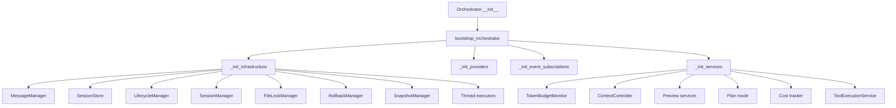
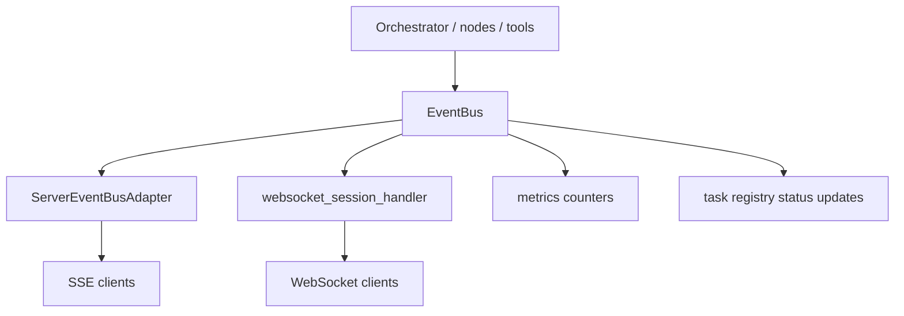

# System Flow Diagrams

This document maps the current user entry points, orchestration flow, tool path, and validation path for review.

Primary code references:
- `src/main.py`
- `src/server/app.py`
- `src/server/task_endpoints.py`
- `src/server/sse_adapter.py`
- `src/server/websocket_handler.py`
- `src/core/orchestration/orchestrator.py`
- `src/core/orchestration/orchestrator_bootstrap.py`
- `src/core/orchestration/inference_loop.py`
- `src/core/orchestration/graph/builder.py`
- `src/core/orchestration/tool_execution_pipeline.py`

## Recommended Next Audit Task

I did not find a single explicit open-items audit backlog document in the repo. What I did find was:
- audit instructions: `docs/audit/audit-instructions.md`
- implemented audit regression suites: `tests/integration/test_phase3_findings.py`, `tests/integration/test_phase4_findings.py`, `tests/_deprecated/test_audit_vol23.py`

Based on the current state, the next highest-value audit task is:

**Add a true system acceptance harness and validation playbook for end-to-end user-visible flows.**

Why this is next:
- the repo has strong unit and targeted integration coverage
- the system still lacks one canonical acceptance layer proving that the main user flows work end-to-end under one repeatable contract
- current validation is split across CLI behavior, graph behavior, server behavior, and tool safety tests rather than one operator-facing "system works" suite

Suggested acceptance scope:
- headless CLI task completes successfully
- write path respects read-before-write and workspace guards
- task API starts a task and reports status
- SSE and WebSocket streaming expose task/session events
- plan approval / wait-for-user path behaves correctly
- final verification path runs when writes succeed

## 1. User Entry Flows

```mermaid
flowchart TD
    U[User] --> CLI[CLI headless: src/main.py::_run_headless]
    U --> HTTP[HTTP API: src/server/app.py]
    U --> TUI[TUI layer]

    CLI --> ORCH1[Orchestrator]

    HTTP --> TASKPOST[POST /task]
    TASKPOST --> TASKTHREAD[_run_task_thread]
    TASKTHREAD --> ORCH2[Orchestrator]

    HTTP --> SSE[GET /session/{id}/events]
    SSE --> SSEADAPTER[ServerEventBusAdapter.event_generator]

    HTTP --> WS[WS /session/{id}/ws]
    WS --> WSHANDLER[websocket_session_handler]

    TUI --> ORCH3[Orchestrator]

    ORCH1 --> RUN[run_agent_once]
    ORCH2 --> RUN
    ORCH3 --> RUN
```

## 2. Orchestrator Bootstrap



## 3. Main Agent Run Flow

```mermaid
flowchart TD
    START[run_agent_once]
    START --> LOOP[run_agent_once_impl]
    LOOP --> INIT[build_initial_state]
    INIT --> GRAPH[get_compiled_graph_for_orchestrator]
    GRAPH --> P[perception]

    P -->|simple tool/action| E[execution]
    P -->|needs context| A[analysis]
    P -->|simple task| PL[planning]
    P -->|done| MS[memory_sync]

    A -->|complex| AD[analyst_delegation]
    A -->|normal| PL
    AD --> PL

    PL --> PV[plan_validator]
    PV -->|approved/valid| E
    PV -->|needs rewrite| PL
    PV -->|needs approval| WU[wait_for_user]

    E -->|next step| SC[step_controller]
    E -->|needs perception again| P
    E -->|needs analysis| A
    E -->|needs replan| RP[replan]
    E -->|done/no-op| MS
    E -->|approval or preview wait| WU

    RP -->|new smaller steps| SC
    RP -->|give up| MS

    SC -->|execute step| E
    SC -->|verify final step| V[verification]

    V --> EV[evaluation]
    EV -->|complete| MS
    EV -->|more planned work| SC
    EV -->|failed| D[debug]
    EV -->|terminal| END[END]

    D -->|retry fix| E
    D -->|give up| MS
    D -->|hard stop| END

    WU -->|approved| E
    WU -->|preview rejected| P
    WU -->|plan rejected| PL

    MS -->|delegations pending| DEL[delegation]
    MS -->|continue session| P
    MS -->|finish| END
    DEL --> END
```



## 4. Tool Execution Flow

```mermaid
flowchart TD
    EN[execution_node] --> EXE[Orchestrator.execute_tool]
    EXE --> PIPE[execute_tool_impl]

    PIPE --> PREFLIGHT[preflight_check_impl]
    PREFLIGHT --> RBW[read-before-write guard]
    RBW --> SCOPE[workspace scope guard]
    SCOPE --> PLAN[plan mode / approval checks]
    PLAN --> PERM[permission gateway]
    PERM --> DRY[dry-run interception]
    DRY --> LOCKS[ToolExecutionService / file locks]
    LOCKS --> REG[tool_registry.get(name)]
    REG --> CALL[tool callable]
    CALL --> FORMAT[result formatting / truncation]
    FORMAT --> HISTORY[last_result + history update]
    HISTORY --> ROUTE[execution routing]
```

## 5. Server Event Flow



## 6. What "System Works" Should Mean

The system should be considered working when these user-visible outcomes all hold:

1. A user can submit a task through at least one primary entry point.
2. The orchestrator builds state, selects the graph, and completes or safely exits.
3. Safe tools are callable and modifying tools respect guards.
4. Successful writes can reach verification and evaluation.
5. Session/task events are observable over server streams.
6. Failures degrade safely: replan, debug, wait-for-user, or terminate cleanly.

## 7. Practical Validation Checklist

### A. Fast local confidence

Run the current focused checks:

```bash
python -m pytest tests/unit/test_server_app.py tests/unit/test_scheduler_http_endpoints.py tests/unit/test_sse_adapter_stream.py -q -p no:logging
python -m pytest tests/integration/test_mock_adapter_integration.py tests/integration/test_delegation_mock.py tests/integration/test_langgraph_orchestrator.py tests/integration/test_agent_loop_plaintext_tools.py tests/integration/test_loop_prevention.py -q -p no:logging
python -m pytest tests/e2e/test_agent_scenarios.py tests/e2e/test_basic_workflows.py tests/e2e/test_small_model_pipeline.py -q -p no:logging
```

### B. Primary user flow validation

Headless CLI:

```bash
python -m src.main --headless --task "Read README.md and summarize the repo" --output-format pretty
```

Dry-run write safety:

```bash
python -m src.main --headless --dry-run --task "Add a hello function to main.py" --output-format pretty
```

Expected result:
- returns an assistant response
- dry-run reports intercepted write/destructive calls instead of mutating files

### C. Server flow validation

Start server:

```bash
python -m src.server.app
```

Then validate:

1. `POST /task` accepts a task and returns `202`.
2. `GET /task/{id}` transitions from `accepted` to `running` to terminal state.
3. `GET /session/{id}/events` emits SSE events.
4. WebSocket session endpoint streams the same task/session events.

### D. Safety validation

These behaviors should be explicitly exercised:

1. Try to modify a file before reading it: should be blocked.
2. Try to write outside working directory: should be blocked.
3. Trigger plan approval / preview wait path: should route to `wait_for_user`.
4. Trigger failing verification: should route to `debug` or terminate safely.

### E. CI validation

Current CI intent after the recent changes:
- `quality`: advisory lint and targeted mypy
- `unit-tests`: full unit suite with coverage
- `platform-smoke`: cross-platform edge cases
- `integration-mock`: stable mock-backed integration smoke
- `e2e-mock`: CI-safe e2e scenarios
- `benchmarks`: scheduled/manual/mainline performance checks
- `live-provider-checks`: optional provider-backed checks

## 8. Suggested Next Deliverable

If you want the next audit task implemented, I would recommend:

**Create `tests/acceptance/` plus one `scripts/validate_system.sh` entrypoint** that proves:
- CLI headless flow
- server task API flow
- SSE/WS streaming flow
- write guardrails
- verification/debug fallback

That would turn the current fragmented validation surface into one reviewable system contract.
